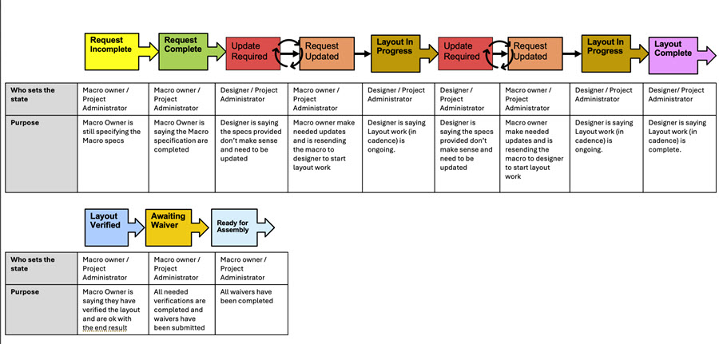

# Macro Status Workflow

When created, macros are integrated into the Intelligent Design process and follow a defined workflow process. As macros follow this defined workflow process, adjustments to the original macro are often required. Intelligent Design Feature keys dictate which user roles can change each various stages of the workflow process.

**Note:** See ID User Role Permissions to view user role permissions.

This image is a visual representation of the stages in a macro workflow.

Extracting from the Macro Workflow graphic, this table defines who can change macros for each workflow stage.

|Workflow Status|Authorized User Role|Purpose|Type|
|---------------|--------------------|-------|----|
|Request Incomplete|Macro Owner/Project Admin|Macro owner is still specifying Macro specs.|Automatic at creation time.|
|Request Complete|Macro Owner/Project Admin|Macro specifications are completed.|Manual|
|Update Required|Designer/Project Admin|Specs are unclear and need updates.|Manual|
|Updated Completed|Macro Owner/Project Admin|Macro Owner made needed updates and is resending for further work to the designer.|Manual|
|Layout in Progress|Designer/Project Admin|Layout work \(in cadence\) is ongoing.|Manual|
|Layout Complete|Designer/Project Admin|Layout work is complete.|Manual|
|Layout Verified|Macro Owner/Project Admin|The macro Owner verified the layout and is satisfied with the result.|Manual|
|Awaiting Waiver|Macro Owner/Project Admin|All needed verifications are completed and waivers are submitted.|Manual|
|Ready for Assembly|Macro Owner/Project Admin|All waivers are completed.|Manual|

**Parent topic:**[Macros](../id_docs/macros.md)

