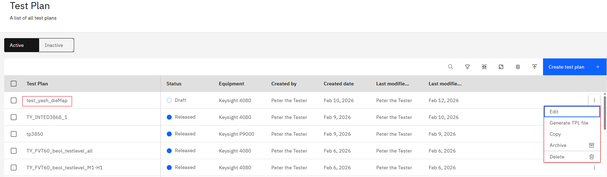
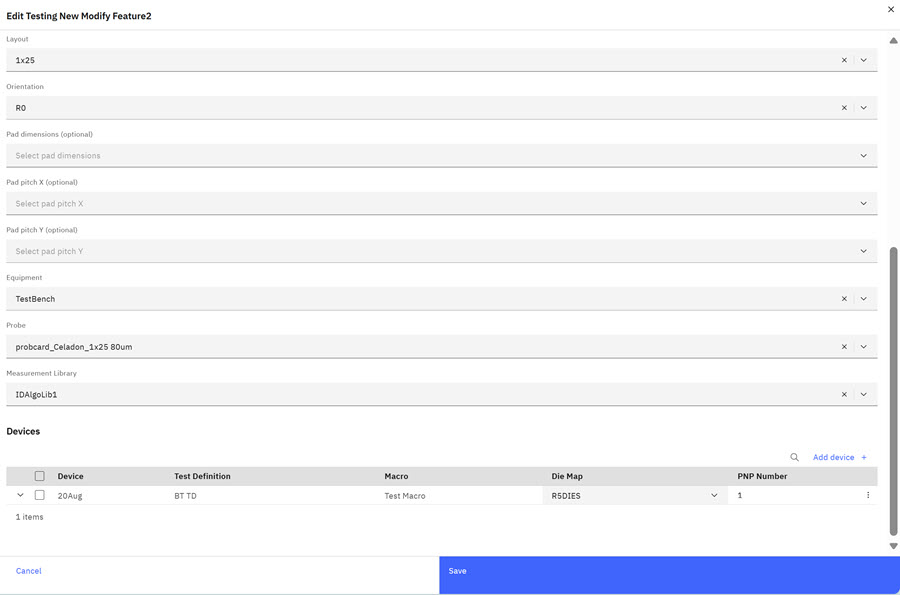
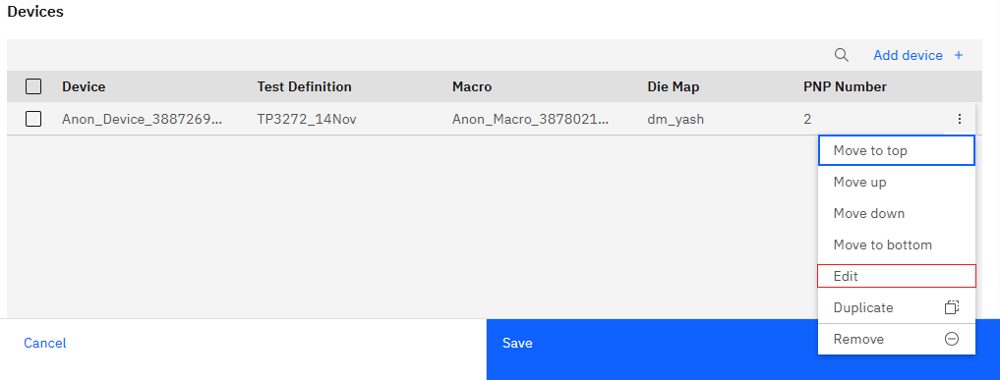
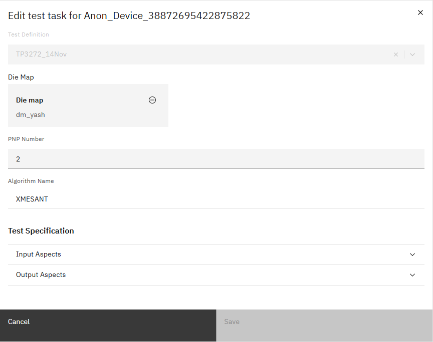
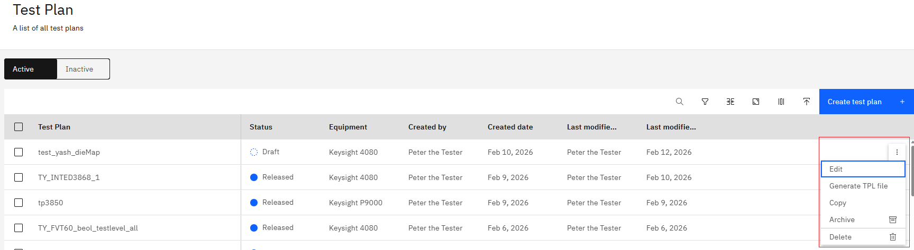

# Modifying Test Definitions on the Fly

During Test Plan testing, modifying test definitions within a **Draft Test Plan** can provide testers with insight into Test Plan results. This feature gives testers a one-time \(on the fly\) opportunity to modify the Test Definition within a **Draft Test Plan**. This one-time modification does not alter the original Test Plan and is not saved for future use. Changes are applied only within the context of the current Test Plan.

Test Plans in **DRAFT** status are the only test plans that can be modified After the status changes to **RELEASED**, the Test Plan is no longer editable.

**Note:** Only Test Engineer Administrators and Testers can create, edit, delete, export, import, upload, or archive Test Plans.

**Note:** Users who are on teams that are assigned to the project that is referenced in a Test Plan are the only ones who can view, edit, delete, export, import, or archive the Test Plan.

1.  Click the **Switcher** icon in the Intelligent Design app and click **Intelligent Test** to open the Test Plan page.

2.  Find the Test Definition to edit, making sure it is in the **Draft** status and click the ellipsis to access the overflow menu options.

    

3.  Click **Edit** to open theEdit s Test Plan page.

    

4.  Scroll down on the Edit aTest Plan Modal to the Devices section and click the ellipsis to access the overflow menu options. Click **Edit** in the overflow menu options to open the **Edit Test Task** modal.

    

5.  The following items can be edited in the **Edit Test Task** modal: Die Map and PNP number. The Algorithm name and the Input Aspects and Output Aspects can be reviewed, but not directly edited. Once changes have been made, clicking **Save** confirms them, and navigates back to the the Edit a Test Plan modal.

    

6.  Clicking **Save** on the Edit a Test Plan modal confirms any changes and reopens the Test Plan page.

7.  \(Optional\) While on the Test Plan page, clicking the ellipsis reveals the overflow menu options to **Edit**, **Generate TPL file**, **Copy**, **Archive**, and **Delete** the Test Plan.

    

**Parent topic:**[Test Plan](../id_docs/it_test_plan_intro.md)

