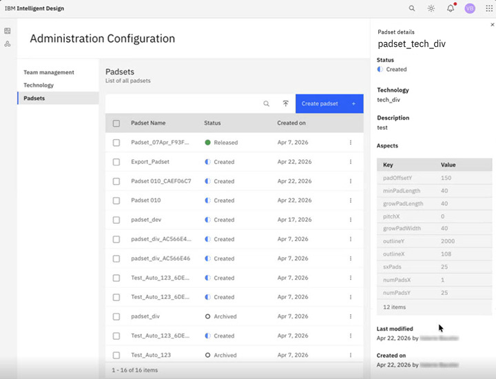

# Padsets

A Padset is a unique set of Pads. A Pad set is used by assigning it to a project, and each Pad set can only be used once.

A Padset is a unique set of Pads with specific Pad combinations and spacing \(i.e. 1x25, 1x50\), designed for a specific kind of electrical test. Each Macro will only have one Padset. Each Testsite will generally have their own Padset designs and there will be many Padset variations. As the number of permutations of arrangements of Pads and designs on those Pads in a Padset is incredibly high, unique Padset names are required.

**Note:** Each Padset can be associated with exactly one Technology. Existing Padsets without a Technology assigned must be retroactively assigned to a Technology before use.

From the Padset page, you can select any Padset in the table with a status of Created, Released, or Archived to see the following details in the side panel:

-   Name
-   Status
-   Technology
-   Description
-   Aspects \(keys and values\)
-   Last modified date
-   Created on date

You can also create new Padsets, edit or delete existing Padsets, or import/export Padsets to or from a .csv file.

**Note:** Only Project Administrators can create, edit, upload/download, or delete Padsets.

-   **[Create a Padset](../id_docs/create_a_padset.md)**  

-   **[Edit a Padset](../id_docs/edit_a_padset.md)**  

-   **[Delete a Padset](../id_docs/delete_a_padset.md)**  

-   **[Import Padsets](../id_docs/upload_download_padsets.md)**  
A Padset is a unique set of Pads. A Padset is used by assigning it to a project, and each Padset can be used only once. Use this import procedure to bulk upload multiple padsets.
-   **[Export Padsets](../id_docs/exporting_downloading_padsets.md)**  
A Padset is a unique set of Pads. A Padset is used by assigning it to a project, and each Padset can be used only one time. Use this procedure to bulk export padsets. Padsets are exported into a .csv file format for use either inside ID or outside of ID. Project Admins can export the Padsets, edit the Padsets, and upload the edited Padsets.

**Parent topic:**[Administration Configuration](../id_docs/id_admin_config.md)

