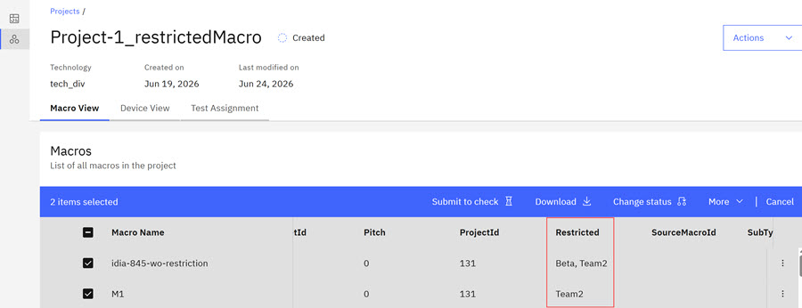
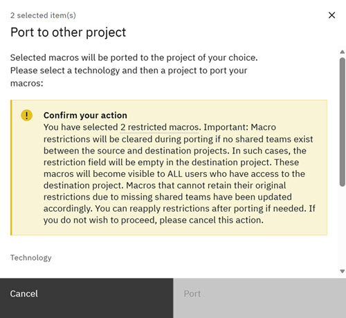
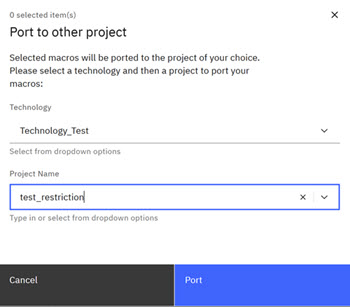

# Porting Restricted Macros

Project Administrators can now take actions when porting restricted macros. When a macro restriction is triggered during macro porting, Administrators can clear the macro-restricted field or cancel the macro port action.

1.  Select the **Project** tab to open a project.

    The Project page opens and displays two tabs, the **Design View** and **Macro View**.

2.  Click **Macro View** and scroll to a restricted Macro you own. In this example, the selected macros are restricted.

3.  Click the checkbox next to the Macro name.

    

4.  Click **More** in the menu bar and then click **Port**.

    A warning modal opens and cautions the Project Administrator that the restricted macros will be cleared during posting. If the Project Administrator proceeds with the macro porting and no shared teams exist between the source and destination project, the macros become visible to all users who have access to the destination project. The porting action can also be canceled. Restrictions can be reapplied after the porting completes.

    

5.  Project Administrator clicks **Port** and the porting action completes with changes as noted in the warning.

    The **Port to Other Projects** modal opens.

6.  On the **Port to Other Projects** modal, select the drop-down arrow in the Technology area and scroll and select a Technology and then select the drop-down arrow in the Project section and scroll and select a Project.

    

7.  Click **Port**. The system responds and ports the selected macro to the designated project.

    A system notification confirms that your Macros were ported to your selected project.

**Parent topic:**[Porting Macros](../id_docs/porting_macros.md)

