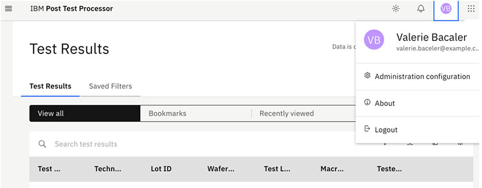

# Administration configuration

To configure SiView disposition and STFP configuration, click your profile icon, then select **Administration configuration**.

-   **[SiView automated disposition configuration](../../id_docs/post_test_calc/siview_disposition_config.md)**  
Within the Post Test Calculation application, a new administrative panel is available from the user's profile link.
-   **[SFTP-based ISDW automated delivery configuration](../../id_docs/post_test_calc/sftp_config.md)**  
To enable reloading TEDs test files and communication with the ISDW database, you must configure an SFTP connection with a password or passkey.

**Parent topic:**[Post Test Calculation](../../id_docs/post_test_calc/ptc_overview.md)

