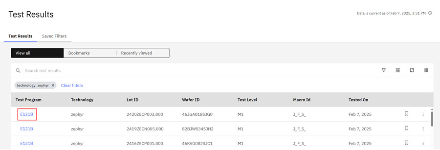
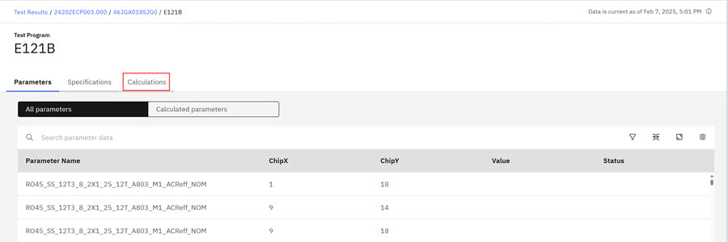
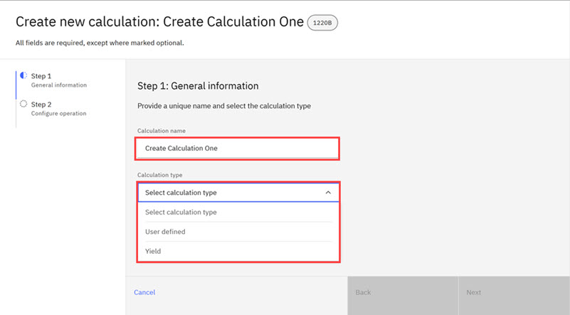
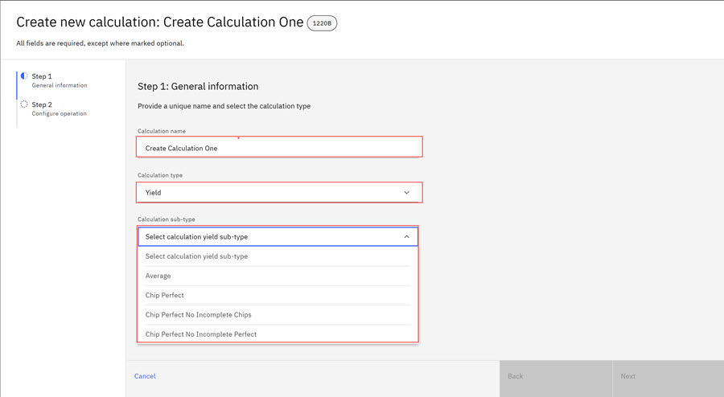
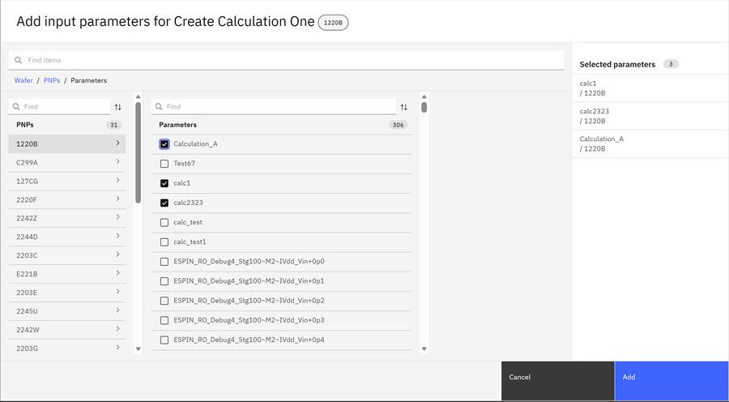
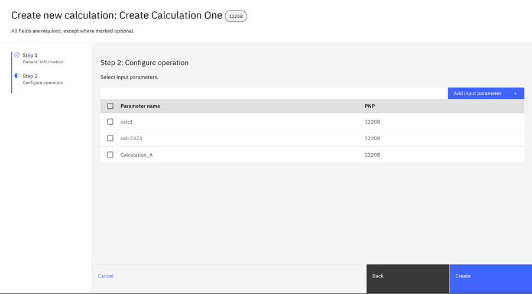
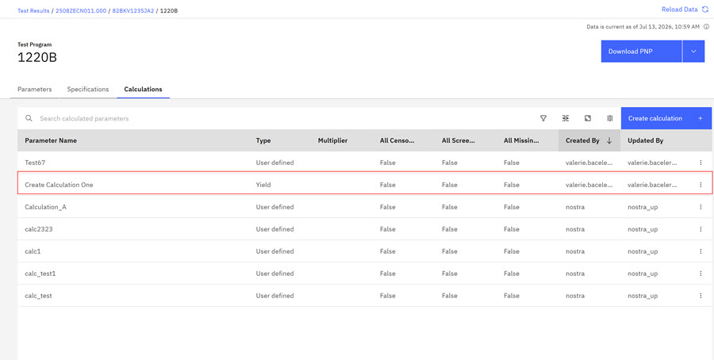

# Assigning Ad Hoc Calculations

On the Post Test Calculation \(Post Test Processor\) landing page, you can assign Ad Hoc Calculations to the wafers. The calculation table outlines the calculation types, operations, and variables that can be used with each calculation type.

Use the following instructions to configure the Post Test Calculation.

1.  Click the **Test Program** identifier on the Test Results page where you want to make your calculations.

    **Note:** Complete all fields in each modal as you configure your calculations.

    

    The Post Test Processor page opens.

    

2.  Click the **Calculations** tab. The Create New Calculations modal opens on **Step 1** of the calculation.

    

3.  Enter the **Calculation Name** then click either **User Defined** or **Yield**.

4.  Click the drop-down arrow and click **Average** for the calculation subtype.

    

5.  Click **Next** on the modal. The Create New Calculations modal opens on **Step 2** of the calculation.

    

6.  Click **Add Input Parameter** to open the Add Input Parameters modal. Select a **Wafer**, a **PNP**, and **Parameters**. The PNP is the Part Number Program that is specified in the Disposition specification.

    

    PNP \(Part Number Program\) == Disposition Specification

7.  Click **Add** to add the parameter\(s\) to your calculation. The Create New Calculations modal opens on **Step 2** of the calculation and shows that the InputParameter just added.

    

8.  Click **Create**. The new calculation is added to the calculations tab on the Tests Program page.

    

**Parent topic:**[Ad Hoc Calculations](../../id_docs/post_test_calc/ad_hoc_calculations.md)

