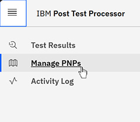
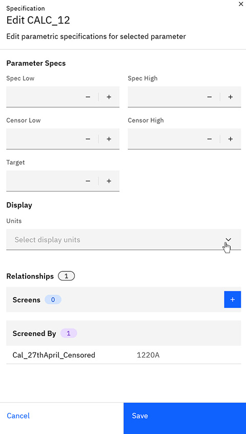

# Editing PNP specifications

You can edit the parametric specifications for selected parameters on the Parameter details page.

1.  In the Post Test Calculation application, select the navigation menu, and click **Manage PNPs**.

    

    **Tip:** To view only calculated parameters, click **Calculated parameters**.

2.  Select the **Specifications** tab.

3.  Select the check box next to each **Parameter name** you want to edit, and click **Edit Specification**.

    

4.  Modify the following parameter specification values:

    -   **Parameter Name**
    -   **Spec High**
    -   **Spec Low**
    -   **Censor Low**
    -   **Censor High**
    -   **Target**
    -   **Units**
    -   **Scale Factor**
    -   **Screens** - True or False value.
    

5.  Click **Save**.

**Parent topic:**[Viewing chip-level test results](../../id_docs/post_test_calc/view_chip-level_params.md)

