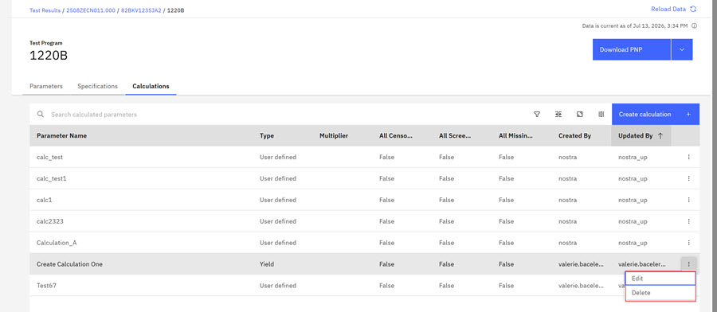
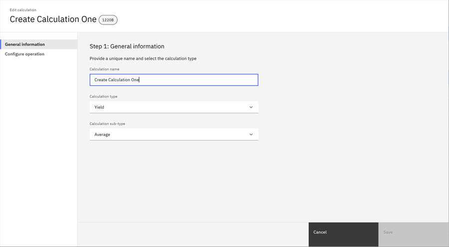
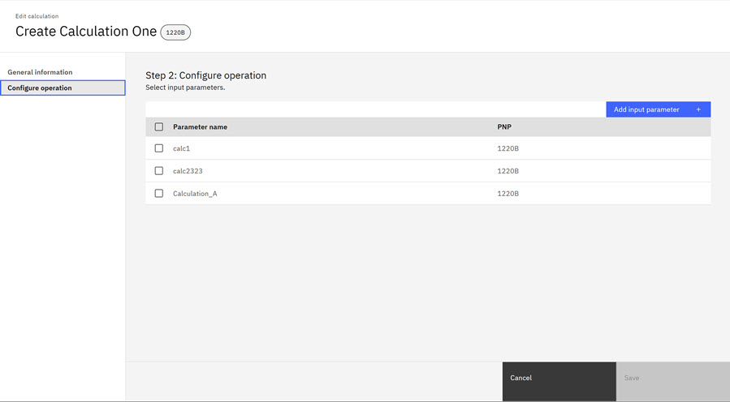
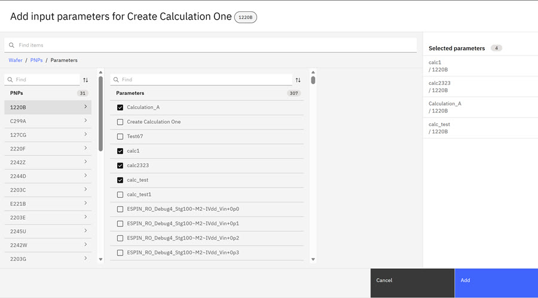
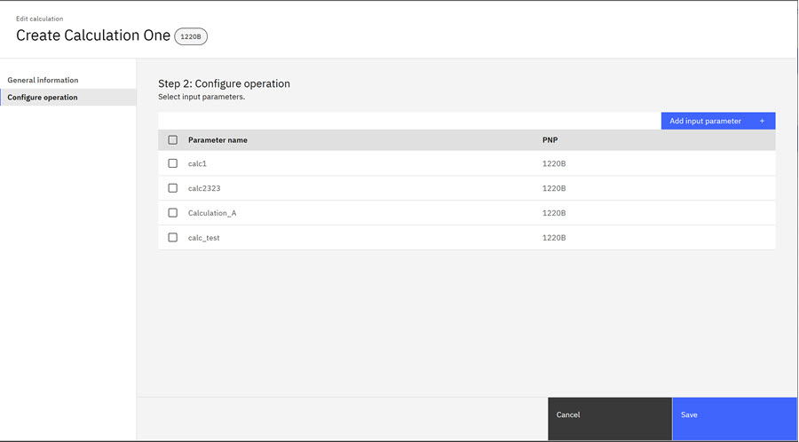
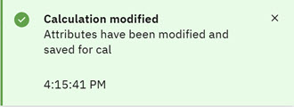

# Editing Ad Hoc Calculations

When Ad Hoc Calculations complete, the test team reviews the yield, which predicts the percentage of prime wafers available for clients at manufacturing completion. If the test team estimates that the test results do not reflect a high percentage of prime wafers, the test team then edits the Ad Hoc Calculations.

1.  Click the **Test Program** that contains the **Calculation** you want to edit.

    

    The Calculation Page opens.

2.  Click the **Calculations** tab on the Test Program page and then click the ellipsis to access the edit function for the calculation \(parameter\) you want to edit. The Edit Calculation - General Information page opens.

    

3.  Complete all the fields on the Edit Calculation - General Information and the subsequent page.

4.  Click the **Edit Calculation - Configure operation** tab. The Edit Calculation - Configure operation page opens.

    

5.  Click **Add Input Parameter** and select input parameters.

    

6.  Click **Add**. The new input parameters are added to the calculation. A notification briefly displays noting the successful addition.

    

7.  Click **Save**. The **Calculation modified** alert confirms that the changes are saved.

    

**Parent topic:**[Ad Hoc Calculations](../../id_docs/post_test_calc/ad_hoc_calculations.md)

