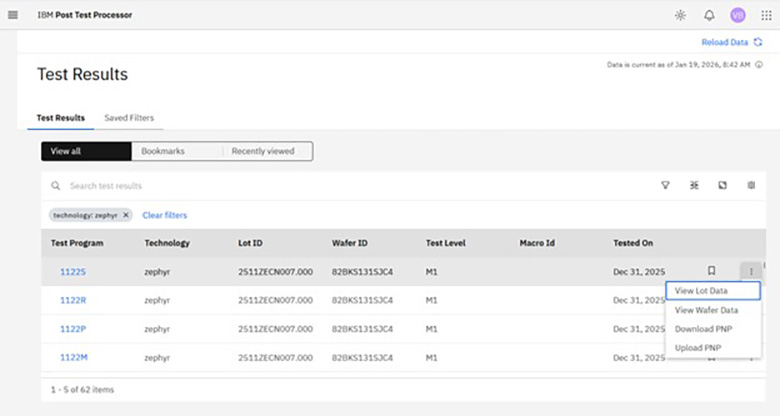
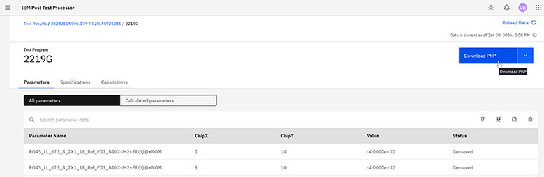
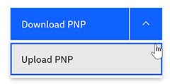

# Exporting and Importing PNP data in .csv format

There are two ways to download a specification and calculation .csv file for a particular PNP.

1.  On the Test Results page, select the **More** icon on the table row of the Test Program that you want to download, then select **Download PNP**.

    

2.  From the Test Results page, open the details page for the Test Program you want to download, then click **Download PNP**.

    

    You can now modify the downloaded .csv file using Excel or similar tools.

    **Note:** The parameter names must follow the regular naming convention: calculated parameters cannot include tilde, semicolon, or backtick characters, and measured parameter names must be formatted `<kerflette>~<testlevel>~<test parameter>`. The type and subtype are the same as you can see in the UI, most commonly Measured, User defined, or Yield. For User defined calculation types, the cpl column should contain the calculation to be performed. The inputparameters column should contain the parameters to use as inputs, separated by semicolons.

    **Note:** For User defined and Mathematical calculations, the order the parameters are entered affects how they will be mapped to variables in the calculation description. The first one will map to v1, the second to v2, etc.

3.  To upload the .csv file after it is modified, perform one of the following actions:

    -   From the Test Results page, select the **More** icon on the table row of the Test Program that you want to upload, then select**Upload PNP**.
    -   On the details page for the Test Program you have modified, click the down arrow next to the **Download PNP** button and select **Upload PNP**.
    

4.  Click **Choose File**, navigate to the .csv file you want to upload, and click **Open**.

5.  Click **Upload**.

    The .csv file is validated before uploading, and any errors are shown in a notification in the top-right corner of the screen.

    **Tip:** Uploading specifications and calculations in a PNP via a CSV completely overwrites the currently existing specifications and calculations for that PNP, so be careful to check before uploading. The system also runs verification checks before loading everything into the system, and any issues are reported to the user.

**Parent topic:**[Viewing chip-level test results](../../id_docs/post_test_calc/view_chip-level_params.md)

