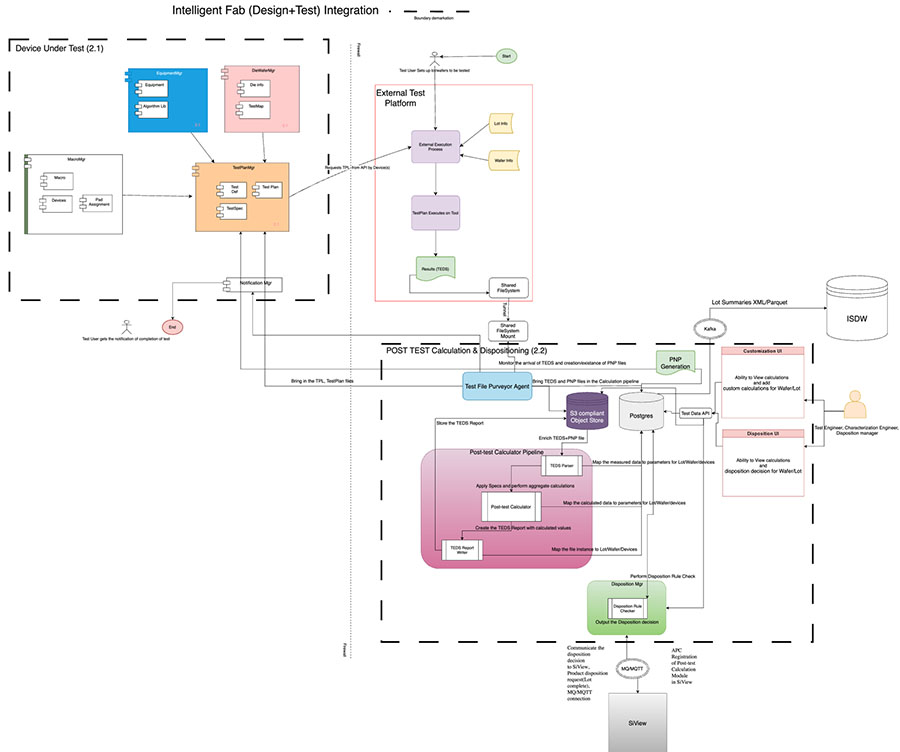
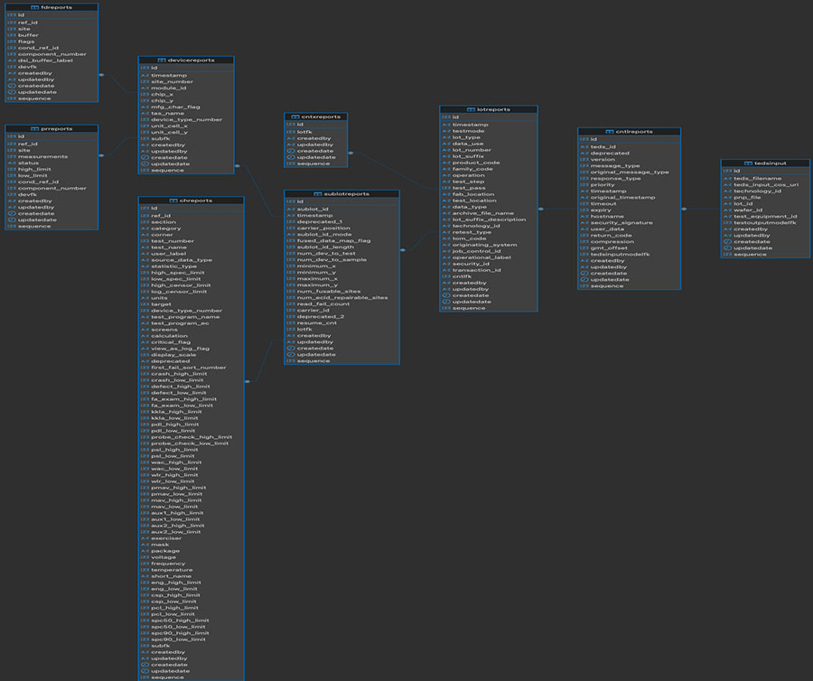
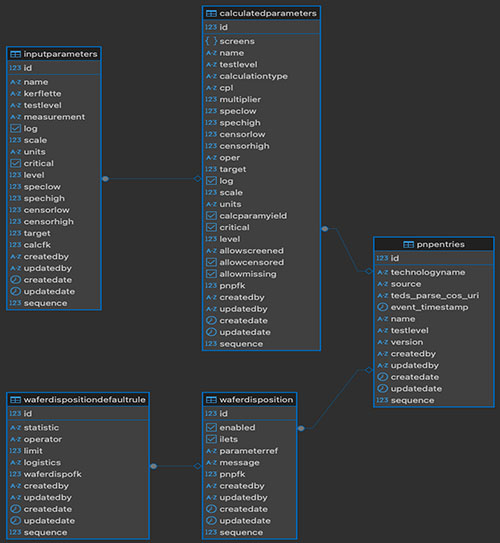
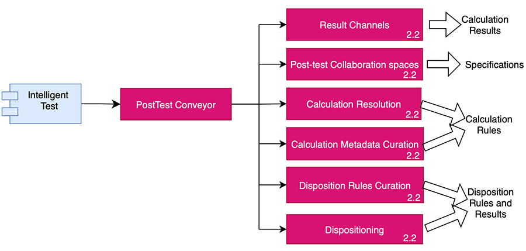

# Post Test Calculation design architecture

The following diagrams provide an overview of the Post Test Calculation design architecture.

## Post Test Calculation architecture \(R2.2\)

-   Fully automated Pipeline
-   Triggered by TEDS File generation
-   TEDS Parsing and PNP integration
-   Object Store and Database logging
-   TEDS Output generation and interacting with ISDW
-   Disposition decisions and integration with Si-View using MQ
-   Entire pipeline flow well below 90 seconds
-   UI interfaces to customize calculations and view disposition decisions

-   Every Report has its own table \(84 tables\).
-   The Tables reflect the relationships of the Report structures of TEDS.
-   Managed in-memory by Pydantic and database interaction managed by SQLAlchemy.
-   Provides the ability maintain and discover data relationships of different parameters of a wafer/lot/die test.

-   Maintains the calculated parameter specifications and rules for disposition for each Wafer/Lot.
-   Maps to PNP entries for each test.
-   The Disposition results are also stored for each state.
-   Similarly managed by Pydantic and SQLAlchemy.

-   View Telemetry of the entire calculation pipeline.
-   Ability to enter and customize calculation formulas and parameters.
-   View dispositioning decisions.
-   Total Release Development and Deployment Status: Continue to develop on User Stories and design specifications that continue to evolve based newly-acquired inputs from SMEs.

-   **[Dependencies](../../id_docs/post_test_calc/ptc_dependencies.md)**  
Dependencies you need to be aware of when installing Post Test Calculation.

**Parent topic:**[Post Test Calculation](../../id_docs/post_test_calc/ptc_overview.md)

