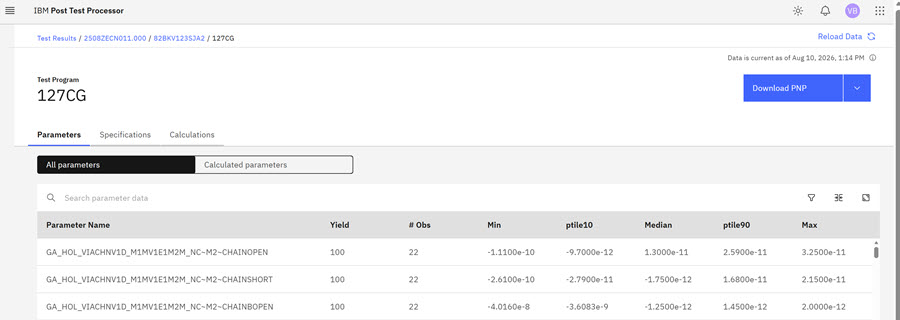
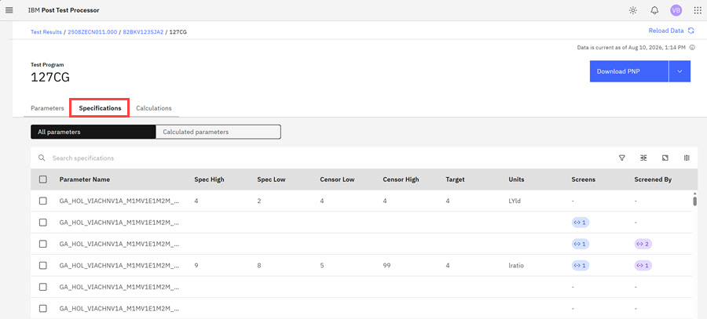
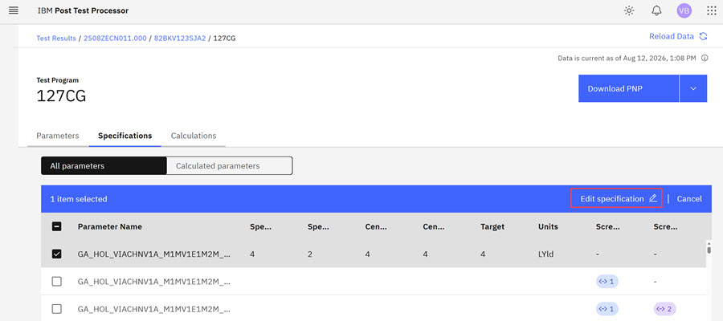
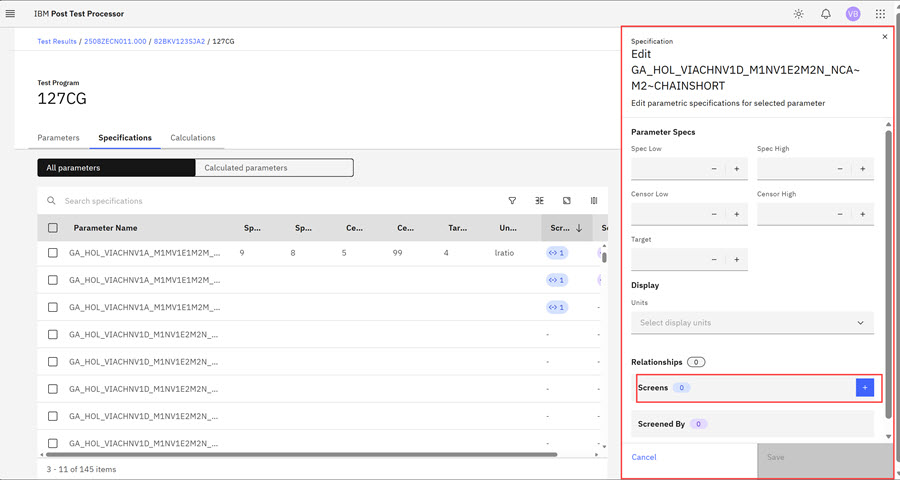
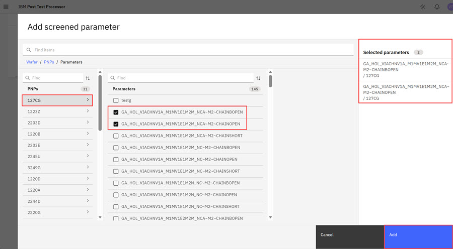
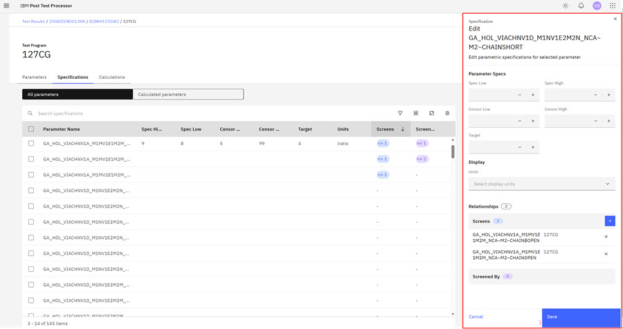
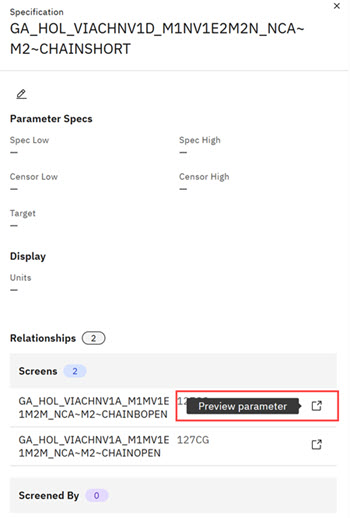
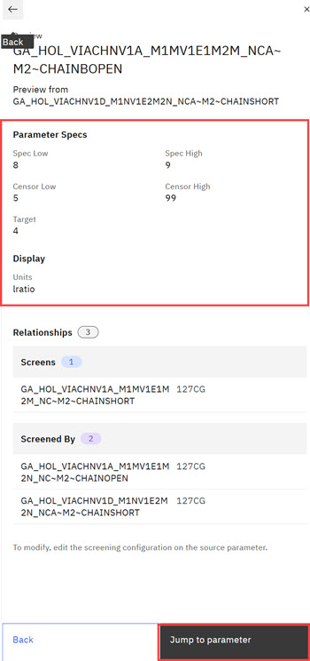

# Parameter Specs and Screening PTC Relationships

Parameter Screening relationships help ensure that parameters are able to communicate well within prescribed ranges. Parameters in PTC each have set values for Spec High and Low, Censor High and Low, Target, Units and Scale Factors. Parameter relationships consist of a primary parameter that selects one or multiple parameters to screen. The primary parameter selects the parameters that it is going to screen. In order for parameters \(the primary and the screened by\) to enter a valid screening relationship, Spec, and Censor Values for each parameter must be within the same value range to help ensure effective communication. When defining screening relationships, first the screened by parameter is the primary parameter is selected and then the screener parameters are defined. Project Administrators can set and edit parameters specs.

Parameter Screening Guidelines

-   One parameter can be screened by multiple parameters.
-   Multiple parameters can be screened by one parameter.
-   A parameter cannot screen itself.
-   Circular dependencies between parameters are not allowed. For example, if parameter A screens parameter B, parameter B cannot screen parameter A. Circular dependencies at the PNP level are also detected and prevented.
-   Duplicate screening relationships are not allowed.
-   Users cannot delete parameters that exist in other screening relationships.

**Note:** Project Administrators with parameter management permissions and view and edit parameter specification and define parameters that it screens.

1.  Login into the **PTC** module. The Test Program page opens.

2.  Click the hyperlink for the **Test Program** you want to view. The Program page opens on the Parameter section.

    

    Viewing the PTC Program Page Specs Tab

3.  Click the Specifications tab. The Specifications page opens. One this tab you can view the Parameter specifications values that display for each parameter, the spec, sensor, target values, units, and existing parameter relationships. The Screens and Screened by Columns indicate that those parameters are engaged in screening. Clicking this item in a parameter row opens the **Specification Edit** modal that displays the relationship details.

    

    **Note:** Click anywhere in the parameter row to open a **View only** edit specification modal.

4.  Click the parameter that you want to set up in a screening relationship and click **Edit Specification** in the menu bar.

    

    The Specification Modal for the selected parameters opens.

    

    The modal presently shows that this parameter is not in a screening relationship. It is presently not screening a parameter or being screened by a parameter.

5.  Click the **+** \(plus\) symbol in the blue square to open the Add Screened Parameter page.

6.  Click the primary parameter and then click the right arrow to open the list of available parameters to the screen. Click the parameters that you want to screen.

    

7.  Click **Add**. The selected screening parameters are display in the right column on the Add Screened Parameter page.

    

8.  Click **Save**. Each added parameter now has a **Preview Parameter** icon next to its name.

    

9.  Click the **Preview Parameter** for each parameter to preview the parameter values.

    

10. Click **Jump to parameter** to browse to the parameter and then click the **pencil**icon to edit any of the parameter values.

    The **Jump to Paraemeter** action to edit a specification is only applicable if parameter is in the same PNP you are presently editing. If it is not, you must browse to the PNP where the parameter is located and edit the parameter in that PNP.

    

11. Click **Save** to save the edited spec values.

    

**Parent topic:**[Viewing chip-level test results](../../id_docs/post_test_calc/view_chip-level_params.md)

