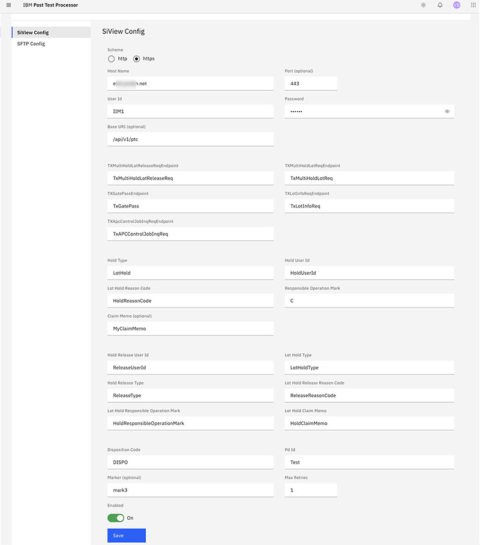

# SiView automated disposition configuration

Within the Post Test Calculation application, a new administrative panel is available from the user's profile link.

Only users with Post Test Calculation administrative rights can perform this task.

1.  In the Post Test Calculation application, click the profile icon and select **Administration configuration**.

2.  On the Administration section of the Post Test Calculation page, enter the following values \(required\).

    -   Scheme \(http or https\)
    -   Host name
    -   User ID \(SiView valid and active User ID\)
    -   Password \(SiView User’s password\)
    -   TxMultiHoldLotReleaseEndpoint
    -   TxMultiHoldLotEndpoint
    -   Disposition Code
    -   Hold Type
    -   Responsible Operation Mark
    -   Enable \(Default is False\)
    -   Lot Hold Release
    -   Hold Type
    -   Hold User Id
    -   Lot Hold Reason Code
    -   Responsible Operation Mark
    -   Claim Memo \(optional\)
    -   Hold Release User Id
    -   Lot Hold Type
    -   Hold Release Type
    -   Lot Hold Release Reason Code
    -   Lot Hold Responsible Operation Mark
    -   Lot Hold Claim Memo
    All other fields are optional.

    

3.  Click **Save**.

After all the required fields contain values, the user can save the configuration values for automated SiView system use. These values are used by the backend when processing a Lot Disposition Request file in order to attempt to communicate the Post Test Calculation disposition decision to the configured SiView instance.

**Parent topic:**[Administration configuration](../../id_docs/post_test_calc/admin_config.md)

