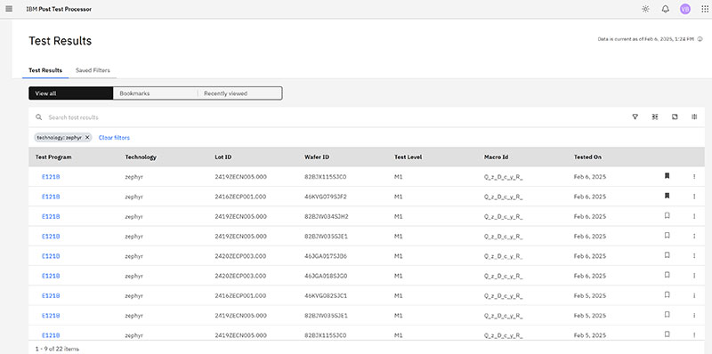

# Test Results

When you log in to the Post Test Calculation application, the landing page opens. It is the entry point into the Post Test Calculation application.

From the landing page, you can view test results and drill down into them to perform calculations on those results, analyze test data, and apply defined calculations. You can also access Lot Data and Wafer Data for each test result.

## Test Results tab

You can select to **View all** test results, view results that you have bookmarked, or **Recently viewed** results. You can apply filters to modify the results you see, as well as sort on any of the columns in the results table.

These are the default columns displayed in the results table:

-   **Test Program** - Click on the Test Program ID to view details of the test, including Parameters, Specifications, and Calculations.
-   **Technology**
-   **Lot ID**
-   **Wafer ID**
-   **Test Level**
-   **Macro ID**
-   **Tested On** - The date the tests were run.
-   **Bookmark icon** - Select the bookmark icon to add a test program to your bookmarks list.
-   **More options** - Click the Options icon to view Lot data or Wafer data for the test program.

To apply a filter set to the table, click the **Filter** icon , select a filter set, and click **Apply**. You can also [create a new filter set](create_filter_set.md) here.

## Saved Filters tab

Select the **Saved Filters** tab to view a list of saved filter sets. Click the **Filter Set Name** to edit a filter set. Click the check box in any column to select and delete filter sets from the list.

-   **[Creating a Filter Set](../../id_docs/post_test_calc/create_filter_set.md)**  
You can apply filter sets to limit the number and type of results that are displayed in the Test Results table. You can apply previously saved filter sets, or you can create a new filter set to use.

**Parent topic:**[Post Test Calculation](../../id_docs/post_test_calc/ptc_overview.md)

