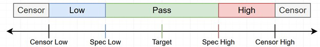

# Viewing chip-level test results

You can view details of the test results for each parameter at the chip level.

1.  On the Test Results page, click on a Test Program.

    The Test results details page opens, displaying an overview of all parameters tested, the X and Y location of the chip tested, the **Value** of the test result for that parameter, and the Pass/Fail **Status** of the test.

    **Tip:** To view only calculated parameters, click **Calculated parameters**.

2.  To view the specifications for each parameter, select the **Specifications** tab.

    The Specifications tab displays the following test results for each parameter:

    -   **Parameter name**
    -   **Yield**
    -   **\# Obs**
    -   **Min**
    -   **ptile19**
    -   **median**
    -   **ptile90**
    -   **max**
3.  Clicking on a Parameter's row open a modal window that displays a per-chip wafer map for the selected parameter. The results can also be seen in table format. Clicking data in the table view will highlight the appropriate era in the wafer view

    

4.  To [edit the specifications](edit_pnp_specifications.md) for one or more parameters, select the **Specifications** tab, select the check box next to each **Parameter name** and click **Edit Specification**.

5.  To [view the calculations](view_calculations.md) for each parameter, select the **Calculations** tab.

    **Notes about statuses:** The possible statuses are:

    -   Pass
    -   Spec High
    -   Spec Low
    -   Censored
    -   Fail
    -   Screened
    Post Test Calculation does not currently support the Screened status. The Fail status can only occur on calculated parameters, not measured parameters.

    -   In some instances, the value can appear empty. This will only occur when the status is Fail and means that either there was a missing input parameter for that calculated parameter or there was some error when carrying out the calculation \(e.g. divide-by-zero error\).
    -   All calculated parameters are always displayed on this screen but may have empty/missing values. However, for measured parameters, only those actually present in the TEDS file are displayed, even if there were other measured parameters used in this PNP before. For example, in the case of two measured parameters \(M1, M2\) and one calculated parameter \(C1\) that depends on M2: If the test plan is modified to stop measuring M2, the parameters table M1 is present, M2 is not present, and C1 displays a status of Fail and an empty value, because its input parameter is missing.

The following diagram shows the statuses that are assigned, depending on where the parameter value lands. Note that none of the values are mandatory, and Pass is the default status. For example, if the spec high and censor high are not set, but spec low is set, then any value above the spec low will be Pass. If censor limits are not defined, values are never censored.

The units and scale factor are not currently used by Post Test Calculation.

-   **[Editing PNP specifications](../../id_docs/post_test_calc/edit_pnp_specifications.md)**  
You can edit the parametric specifications for selected parameters on the Parameter details page.
-   **[Exporting and Importing PNP data in .csv format](../../id_docs/post_test_calc/export_import_pnp_data.md)**  
There are two ways to download a specification and calculation .csv file for a particular PNP.
-   **[Parameter Specs and Screening PTC Relationships](../../id_docs/post_test_calc/screening_ptc_relationships.md)**  
Parameter Screening relationships help ensure that parameters are able to communicate well within prescribed ranges. Parameters in PTC each have set values for Spec High and Low, Censor High and Low, Target, Units and Scale Factors. Parameter relationships consist of a primary parameter that selects one or multiple parameters to screen. The primary parameter selects the parameters that it is going to screen. In order for parameters \(the primary and the screened by\) to enter a valid screening relationship, Spec, and Censor Values for each parameter must be within the same value range to help ensure effective communication. When defining screening relationships, first the screened by parameter is the primary parameter is selected and then the screener parameters are defined. Project Administrators can set and edit parameters specs.

**Parent topic:**[Post Test Calculation](../../id_docs/post_test_calc/ptc_overview.md)

