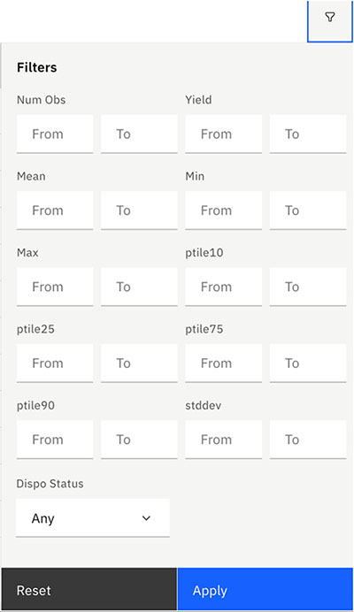

# Viewing Lot Data

You can view chip-level data measurements from the Test Results and analyze the results to be used for specifications, calculations and disposition.

Shows wafers in the lot

Lot Summary tab

Lot test results

1.  On the Test Results page, select the **More Options** icon in the row for a Test Program, and click **Lot Data**.

    The Lot Overview page displays a summary table of the wafers in this lot, including the following data:

        |**Wafer ID**| |
    |**\#Obs**|The number of “valid observations” for this summary. Censored, screened, or missing values are not included.|
    |**\#inSpec**|The number of observations that fall between the high and low spec limits|
    |**\#notInSpec**|The total number of error observations.|
    |**\#specLow**|The number of observations that were less than the spec low limit.|
    |**\#specHigh**|The number of observations that exceeded the spec high limit.|
    |**\#censored**|The number of observations that were outside of the censor limits.|
    |**\#screened**|The number of observations removed \(screened out\) because of out-of-spec screen parameters.|
    |**missing**|The total number of missing observations|
    |**errors**|The total number of error observations|
    |**Dispo Status**|The Pass or Fail status of the Disposition for each wafer in this lot.|

    **Tip:** You can use filters to control ranges for specific aggregate columns within the Lot and Wafer Summary pages.

    

2.  To view wafer data, click on a **WaferID** in the table.

3.  To view Lot Test Results, select the **Lot Test Results** tab.

    The Wafer Test Results tab opens, displaying a table of all test programs in the wafer and the following information for each one:

    -   **Test Program**
    -   **Wafer ID**
    -   **Test Level**
    -   **Macro ID**
    -   **Tested On** date
    Click a **Test Program** in the table to view the test details, including Parameters, Specifications, and Calculations.

4.  To view the Lot Disposition Status, select the **Lot Disposition** tab.

**Parent topic:**[Post Test Calculation](../../id_docs/post_test_calc/ptc_overview.md)

