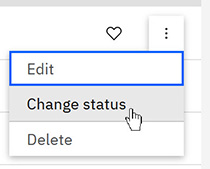

# Project status

Project Administrators can change the status of a project to consistently track project progress, gating, and exceptions across the workflow.

**Tip:** To change the status of a project, click the **Actions** menu next to the project in the Projects table, and select **Change status**.

Choose from the following statuses for your project:

|Status|Type|Description|
|------|----|-----------|
|Created|Automatic|Project is created.|
|Open|Manual|Ready for work to begin.|
|Macro List Frozen|Manual|No new macros can be created. Edits of existing macros are allowed \(except for Macro Name\).|
|Waivers in Progress|Manual| |
|TEG Assembly|Manual| |
|Abandoned|Manual|Project discontinued. All macros are locked \(can only be unlocked by Project Administrator\).|
|Blocked|Manual|Work blocked by dependency or issue. All macros are locked \(can only be unlocked by Project Administrator\).|
|ILT Setup|Manual|ILT tracks open. Test Assignments are in progress, RDF is uploaded, all macros are locked \(can only be unlocked by Project Administrator\).|
|Grindside Setup|Manual|Grindside macros and GS tests enabled. GS RDF import enabled.|
|Build|Manual|Build/Release phase. All macros are locked \(can only be unlocked by Project Administrator\).|
|Paused \(Stop Work\)|Manual|Temporary stop-work flag. All macros are locked \(can only be unlocked by Project Administrator\).|

**Parent topic:**[Projects](../id_docs/id_projects.md)

