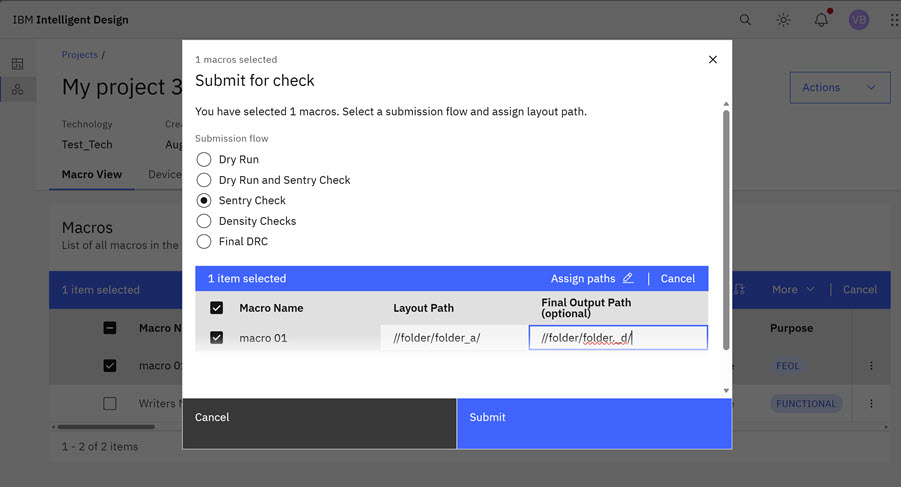
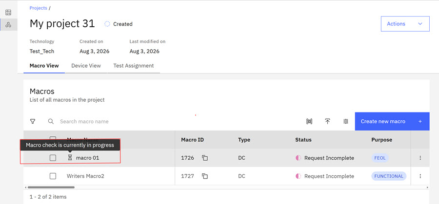
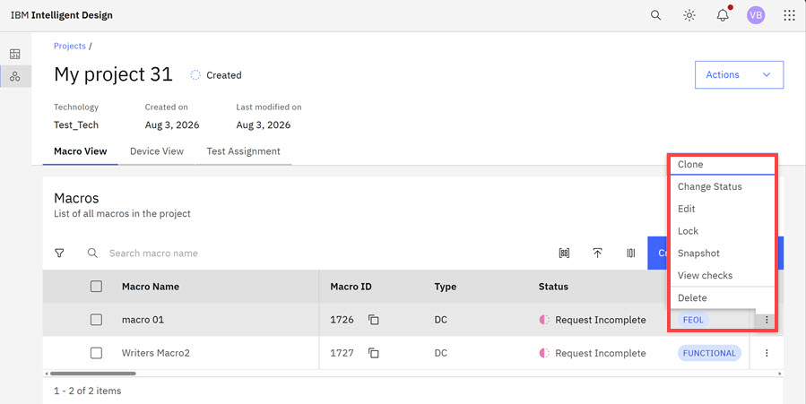

# Selecting Testsite Macros and Validating Readiness

ID users can submit verification checks on macros they own to help ensure that the verification type is available. ID Users can select Dry Run, Dry Run, and Sentry. Density Checks, and Final Design Rule Check \(DRC\) verification checks. **Dry Run** verification validates configuration, inputs, and sets up for a macro. **Dry Run** and **Sentry** verification combine to validate configuration, inputs, and sets up for a macro and does a fast structural check. **Density** verification helps ensure that macros comply with density constraints. **Sentry** verification checks for fast structural checks. **Final DCR** verification helps ensure that macros comply with all required technology and manufacturing rules. There is no enforced order between flows. When Verification checks are complete, ID User can view the results of the checks by using the overflow menu for each macro. Validation is not performed on incorrect or redundant submissions. ID Users can run multiple flows on the same macro and use the same layout field, but multiple flows cannot run simultaneously. The system stores and can display all verification runs on each macro. After a verification flow is submitted, that flow must be complete or canceled before a new flow can be submitted.

Macro Owners, Project Administrators, and Designers can validate Macro readiness for macros they own.

**Note:** Only Core macros, copies of core macros, group members that are not clones, and module parent macros can be submitted for validation. Clone macros, parents of clone macros, and module members cannot be submitted for validation. Before submission for validation, the system validates that the macro contains the required information such as technology, project, macro name, and layout path. If any required information is missing, an alert opens identifying the missing required information and the submission is blocked.

1.  In Intelligent Design, select a **Project** you own.
2.  Click the checkbox for a macro you own within the Project. You can select more than one macro you own. Click **Submit to check**. The **Submit for check** modal opens. Click the submission flow that you want for this macro.

    **Note:** If you selected a number of macros and are submitting simultaneously, you can use the search field to search for specific macro names or layout paths. Hover over either the **Macro Name** and **Layout Path** columns to view and use **Ascending or Descending** sorting for the columns.

    

3.  Click and enter a **Layout path** in the **Layout Path** text box for an individual macro. The **Layout path** informs the verification system on where to fetch the layout files to run the selected checks.
4.  Submissions for **Density** checks require the completion of a **Final Output Path**.

    

    After submission of **Density** checks, click the **View Check** for the macro to view the **Final Output Path**.

    

5.  Select the macros that you want to submit. The **Assign Path** control allows users to designate a layout path and apply it to multiple selected macros \(bulk option\). After a verification flow is submitted and confirmed, it cannot be edited. Users can submit another run of their choice when the verification run completes.

    

6.  Click **Submit**. The Check begins. Submission confirmation briefly displays and states the number of macros successfully submitted. Once confirmed, the submission cannot be edited but the user can submit another run of choice after the check is complete. Hover the cursor on the icon next to the submitted Macro to view the progress of the check.

    

    When the check completes, a **Results Available** confirmation displays for each macro that is submitted for verification. Each set of results can be downloaded as a tgz file.

7.  Click the Ellipsis in the Macro row to see options for macros submitted for validation. Options are **Clone**, **Change Status**, **Lock**, **Snapshot**, and **View Checks**, and **Delete**.

    

8.  Click **View Checks** to view verification checks for your macros. The Checks modal opens. ID users can view and download the .tgz file. If multiple flows are run on a macro, all flows display in the **Checks** modal. Statuses that might display in the **Checks** modal are **Submitted**, **Queued**, **Running**, **Awaiting Results**, **Completed**, and **Submission Failed**.

    

    The system maintains a run history including the submission date and type, flow type, status, and results summary.

9.  Click **Close** to close the modal.

**Parent topic:**[Creating Macros](../id_docs/creating_macros.md)

