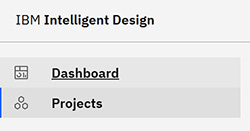

# Status and Design Lifecycle Dashboard

The Status and Design Lifecycle dashboard is the default landing page when logging into **Intelligent Design**.

The Dashboard is the default landing page when you log in to the application. It provides a visual summary of mac ro activity and progress for the selected project.

**Note:** The Macro Status dashboard graphic displays are restricted to a user's permission. Accessible options on the **Technology** and **Project** menus are also user privilege driven and only display options the user is authorized to access.

To get started, choose a **Technology** and **Project**. Click **Refresh Charts** to confirm the values and reload the dashboard. The Dashboard retains the selected filters until they are overwritten by pressing **Refresh Charts** again, displaying the information in two charts:

## 1. Macro Status Chart

This chart shows the **total number of macros** in the selected project, and their current statuses. It gives you a quick overview of how many macros are Request Incomplete, Request Complete, Design and so on.

## 2. Cumulative Macro Status Chart

This chart shows the **overall timeliness and progress trend** of macros in the project. It reflects how many macros are on time, delayed, or overdue, along with their respective statuses.

Both charts include helpful options:

-   **Download Chart as Image** – Save the chart for sharing or reporting.
-   **View Data** – Switch to a tabular format to see the raw chart data.

You can use optional filters such as **Purpose** and **Source** in addition to **Technology** and **Project** to further filter the displayed results. These additional fields help narrow down the macro set you are analyzing, but are not required.

If no results match your filter selections, the dashboard displays:

**No results found for your selected filters; Try adjusting your filters.**

The Dashboard helps you quickly evaluate macro health, identify delays, and stay informed about your project’s overall design progress.

## Application controls

The following icons display on the ID application menu.

**Light/Dark Mode** Click to toggle between light and dark mode or system setting.

 **Notifications**

 **Switcher** Click the **Switcher** icon to move between the Intelligent Design, Intelligent Test, and Post Test Calculation modes.

**Note:** The Intelligent Test mode is visible to users with either the Tester or Project Administrator roles.

 **User** Click the **User** icon to access the Admin Functions. Only users with admin user privileges can view this content.

**Parent topic:**[Application elements](../id_docs/id_navigation.md)

