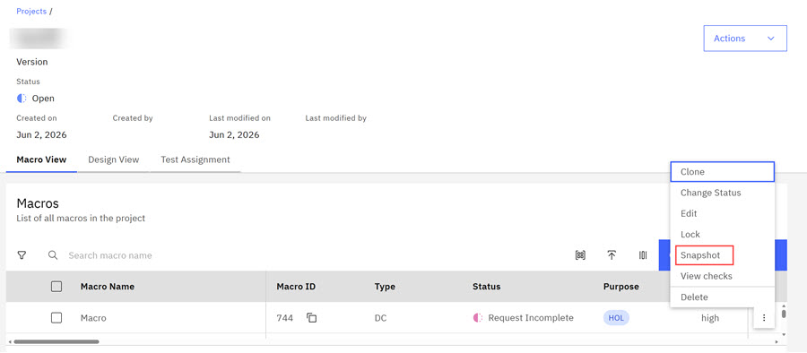
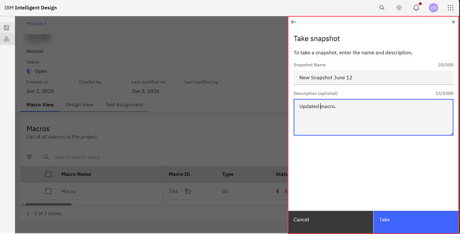
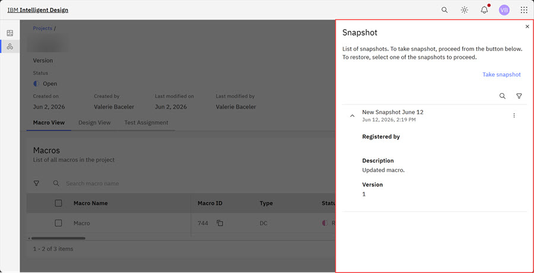

# Taking a snapshot of a Macro

You can use the snapshot function to take a snapshot of the state of a Macro and all of its Devices and Padsets at a specific point in time. You can then restore the Macro to the same state at the specific point in time when the snapshot occurred.

1.  On the **Macro View** tab, select the ellipsis at the row's end to open the **Options** modal. Click **Snapshot**.

    

2.  Click **Snapshot**. The Snapshot modal opens.

    

3.  Type a **Snapshot Name** and **Description** \(optional\) for the snapshot, and click **Take**. The Snapshot modal reopens. Click the carat to open details about the snapshot.

    

**Parent topic:**[Macros](../id_docs/macros.md)

