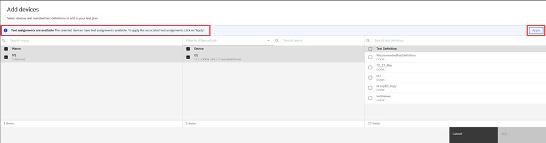

# Managing Devices in Test Plans

Multiple Devices can be added to a Test Plan, each with its own Macro and Die Map. When a user accesses a Test Plan, the user can only view and select macros and devices that their team is authorized to access. Restricted macros and their associated devices are not displayed in the device selection table or any related selection modals.

The Device Management steps that are covered in this task are part of creating or editing a Test Plan.

**Note:** Users who are on teams that are assigned to the project that is referenced in a Test Plan are the only ones who can view, edit, delete, export, import, or archive the Test Plan.

1.  Select **Add Device** on the Create Test Plan modal after defining the **Project**, **Equipment**, **Probe**, and **Measurement Library**. The **Add Device** modal opens.

2.  On the **Add Device** modal, select or search for a valid **Macro**. Selecting a macro activates a list of compatible **Devices**. The Device list can be searched or further filtered by selecting an **iltDeviceCode**.

    **Note:** The Devices available to add are dependent upon the **Equipment** and **Measurement Library** selected for the Test Plan.

3.  Selecting a **Device or Devices** from the list populates the device's associated **Test Definitions** list and notifies you if **Test Assignments** are available. On this modal, you can select **Test Definitions** and apply **Test Assignments**.

    **Note:** On the **Add Devics** modal, a prompt displays **Test Assignments are available. The selected Devices have Test Assignments available. To apply the associated Test Assignments, click Apply**.

4.  Select the **Test Definitions** to associate with the device AND click **Add**. Click **APPLY** to add **Test Assignments** to the Device.

    

    **Note:** **Test Assignments** are created by **Macro Owners** to request specific tests \(test definitions\) to be executed on a given device. When there are Test Assignments available, a Test Engineer can select **Apply** to choose test assignments that are automatically preselected on the Test Plan Device configuration screen. Clicking **Apply** allows **Test Engineers** to easily apply the requested test assignments to devices when creating and configuring a test plan, ensuring the Macro Owner’s testing intent is followed accurately.

    In summary,

    -   Macro Owners create Test Assignments..
    -   Then they are sent to Intelligent Test.
    -   Test Engineer can apply them in the creation of a test plan.
5.  If variables and arithmetic expressions that are used in Test definitions have some errors, error details display device name, test definition name, parameter name, parameter value, and error type on a modal. You can copy the error details into the clipboard before proceeding to the next step.

6.  [Assign a **Die Map**](assign_die_maps.md) to each Device.

7.  Assign a **PNP Number** to each added device. Each PNP Number must be unique.

8.  To add other Devices, repeat the preceding steps as many times as required.

9.  To change a Device's position in the list, click the **Hamburger menu** by the PNP Number and select **Move to Top**, **Move Up**, **Move Down**, or **Move to Bottom**. The Device's position on the list changes immediately.

10. To edit a Device in the list, click the **Hamburger menu** by the PNP Number and select **Edit**. The Test Definition, Die Map, and PNP Number can be changed here. Clicking **Save** confirms any changes and returns to the test plan.

11. To remove a device from the Devices List, click **Remove**. The device is removed immediately and cannot be recovered.

12. When every added Device has been given a Die Map and PNP number, The Test Plan can be created by clicking **Create**. If updating an existing test plan, click **Save**.

-   **[Assigning die maps to devices](../id_docs/assign_die_maps.md)**  
You can assign a die map to a single device, or assign the same die map to multiple devices.
-   **[Creating a die map on the fly](../id_docs/create_die_map_on_the_fly.md)**  
You can create a Die Map as part of the process of assigning die maps to devices.

**Parent topic:**[Test Plan](../id_docs/it_test_plan_intro.md)

