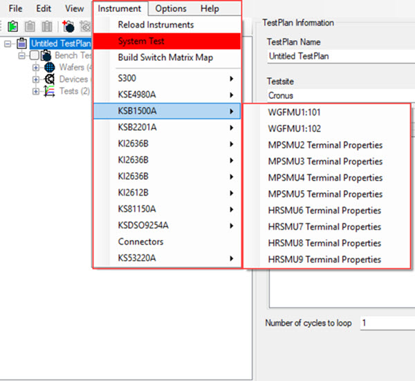

# TestBench Instruments

TestBench in simulator mode supports several instruments and probers that are used to test electrical devices on wafers.

When the TestBench application starts up, the application automatically scans and locates the testing instruments and populates the instrument interface list in TestBench. At any time during TestBench configuration, you can select **Reload Instruments** to reload the TestBench interface instrument list.

The following image shows a fully populated interface instrument list. Mousing over each instrument interface displays the measuring instrument on that interface.

The following table outlines the supported TestBench instruments with a short description of their capabilities.

|Instrument Name|Description|
|---------------|-----------|
|Source Measurement Unit \(SMU\)|Sources current or voltage and measures current and voltage \(individually or together\).|
|Pulse Generator Unit \(PGU\)|Creates voltage pulses.|
|Counter|Counts pulses.|
|Oscilloscope|Time Domain measurement of voltage.|
|WGFMU|B1500A specific terminal to source and measure current and voltage quickly.|
|LCR|Inductance \(L\) Capacitance \(C\), and Resistance \(R\) meter. Measures impedance.|

-   **[TestBench System Test](../../id_docs/testbench/testbench_system_test.md)**  
The TestBench System Test verifies the Switch Matrix Configuration by checking the connections through the switch matrix.

**Parent topic:**[TestBench Overview](../../id_docs/testbench/testbench_overview.md)

