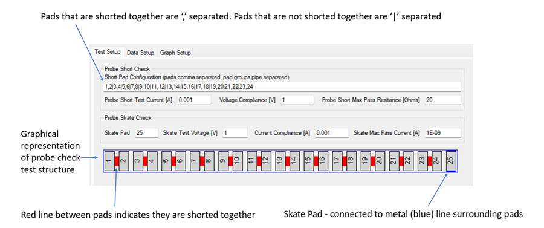

# Configure a Probe Check

Probe check tests in TestBench do not require users to select a particular instrument terminal. For this test, TestBench automatically selects the instrument terminals necessary for the measurements.

In TestBench, possible SMUs and GNDUs for the test are down-selected from connected SMUs and GNDUs that are configured with the switch matrix \(required\). SMU preference is given in the following order:

1.  B1500A High Resolution \(HRSMU\) or Medium Power \(MPSMU\)
2.  Keithley 2636 or Keithley 2612
3.  B1500A High Power \(HPSMU\)
4.  Any other SMU instrument terminal

Short Pad Configuration parameter describes the layout of the probe check test structure. Pads that are shorted together are pipe separated **\|**. The following image is a representation of the test structure with numbered pads and a red line between shorted pads.

Perform the following tests as part of the Probe Short Check.

1.  Probe Short Test Current \[A\] is the current sourced in amps by the SMU to measure continuity between shorted pads.

2.  Voltage Compliance \[A\] is the maximum voltage that is allowed when sourcing the current.

3.  Probe Short Max Pass Resistance \[Ohms\] is the maximum resistance to be considered a passing result from the continuity check.

**Parent topic:**[Probe Check](../../id_docs/testbench/probe_check.md)

