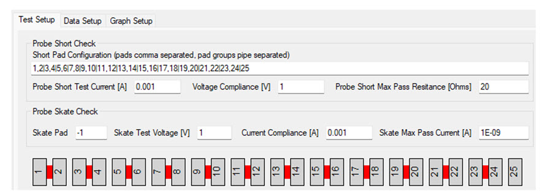

# Configure a Probe Skate Check

Probe check tests in TestBench do not require users to select a particular instrument terminal. For this test, TestBench automatically selects the instrument terminals necessary for the measurements.

In TestBench, possible SMUs and GNDUs for the test are down-selected from connected SMUs and GNDUs that are configured with the switch matrix \(required\). SMU preference is given in the following order:

1.  B1500A High Resolution \(HRSMU\) or Medium Power \(MPSMU\)
2.  Keithley 2636 or Keithley 2612
3.  B1500A High Power \(HPSMU\)
4.  Any other SMU instrument terminal

The Skate Pad number is the pad number that connects to the metal ring surrounding the set of pads. In the following image the blue lines represent the probe skate pad connection to the metal lines surrounding the pads.

Note that the probe skate pad could be located at any position in the set of pads. It can also be shorted to other pads as shown in the following figure.

To disable the probe skate check enter the integer **1** for the skate pad and the probe skate check portion of the test is ignored as shown in the following image.

Perform the following tests as part of the Probe Skate Check.

1.  Skate Test Voltage \[V\]: The voltage to apply between the probe skate pad and the rest of the pads that are not shorted to the probe skate pad.
2.  Current Compliance \[A\]: The maximum allowed current in amps when applying the skate test voltage.
3.  Skate Max Pass Current \[A\]: The maximum measured current to be considered a passing result from the probe check leakage test.

1.  Skate Test Voltage \[V\] is the voltage to apply between the probe skate pad and the rest of the pads that are not shorted to the probe skate pad

2.  Current Compliance \[A\] is the maximum allowed current in amps when applying the skate test voltage.

3.  Skate Max Pass Current \[A\] is the maximum measured current to be considered a passing result from the probe check leakage test.

**Parent topic:**[Probe Check](../../id_docs/testbench/probe_check.md)

