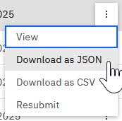

# Downloading results of a Test Bench job

You can download the results of a Test Bench job in JSON or .csv format.

1.  On the **Test Bench** page, select one or more Test Bench jobs with a status of **Completed**.

    **Note:** Only users who are on teams assigned to the project that is referenced in a TestBench job can view, edit, delete, or download that TestBench job.

2.  Select the **Options** icon next to one of the selected Test Bench jobs, and click **Download as JSON** or **Download as CSV**.

    

    A JSON or .csv file is created that includes all collected data across tests. Test Bench displays a notification when the file is complete.

3.  Click **Download** on the notification to complete the download.

**Parent topic:**[Test Bench](../../id_docs/test_bench.md)

