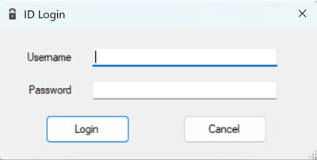
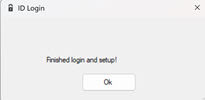
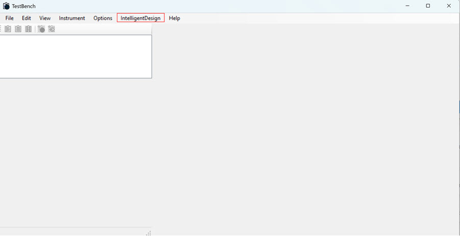

# Logging in to TestBench

Intelligent Test \(IT\) and TestBench work together in processing IT test plans. IT sends test plans to TestBench for execution. TestBench returns \(in real-time\) the test plan statuses and results to IT where users can view and monitor test plan statuses. After installation, TestBench users are required to log in to the TestBench app, even though the user might already be logged in to ID.

1.  Click **File** \> **Login** to open the Login UI.

    

2.  Enter your username and Password.

3.  Click **Login**.

4.  A system prompts opens and shows a probecard number and asks if this is the currently attached probecard.

5.  Click **Yes**.

6.  A system prompt opens and asks the location of the test cell.

7.  Input **Liability Lab**.

8.  Click **OK**. The TestBench app opens and **Intelligent Design** menu is now on the TestBench app menu.

    TestBench displays a system prompt notifying you login and setup is complete.

    

    

    The ID menu provides access to view the current ID job queue, installed probecard, and Register Test Cell action.

**Parent topic:**[Installing TestBench](../../id_docs/testbench/installing_testbench.md)

