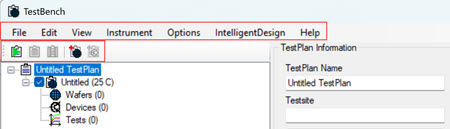
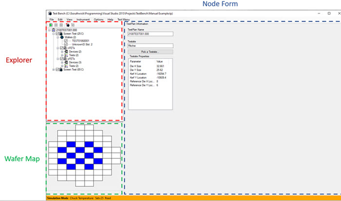

# TestBench Components

TestBench is a characterization software program for Windows™ that allows users to create and configure customized WaferTestPlans and DeviceTestPlans. A test plan defines a test's scope; wafers to be tested \(wafer test\), devices to be used \(device test\), and instruments to use for probing. TestBench test plans are fully customizable. TestBench can be used in Active Mode or Simulation Mode. This document focuses on the TestBench in Simulation Mode.

The TestBench Simulator opens in an Explorer window and displays an Application File menu and an adjacent Icon menu in the Explorer Window.

The Application File Menu options provide paths into the TestBench application and test configurations. The Icon menu contains controls that directly execute, stop, or pause TestBench functions. The following tables outline the File and Icon functions.

|File Menu|Available Actions|
|---------|-----------------|
|File|New/Open/Close, Save/Save As, Simulate, Log GPIB calls, Save/Load System Configuration, Load Wafer/Device Selection, Logout, Exit|
|Edit|Undo|
|View|Simple Data Viewer - The Simple Data Viewer stores the results from TestBench Test Plans.|
|Instrument|Reload Instruments, System Test, and Build Switch Matrix, and a list of installed instruments.|
|Options|Test Plan Options \(Set X and Y Probe Offset\), Save Data to Zip|
|Intelligent Design|Logging in to TestBench \(File \> Login\) loads the Intelligent Design menu and enables you to Load Test Definitions and Test Plans to Intelligent Design. In **Simulation** mode, View Job Queue, Current Probecard, and Register Rest Cell are not available.|
|Help|TestBench Version Information|
| | |
|**Application Icons**|**Action**|
|

|TestBench Application Icons perform the following actions \(left to right\): Execute Test Plan Execution, Stop Test Execution, Pause Test Plan Execution, Add Wafer Test Plan, Add Device Test Plan|

Next to the File and Icon Menus in the Explorer Window are three sections: Explorer, Wafer Map, and Node Form.

This table displays the components within each section of the TestBench Explorer UI and the interactivity that occurs when users select nodes in the test plan tree. Each node in the BenchTest Tree is a BenchTest configuration point. See TestBench Plan Configuration.

|Bench Test Components|Description|
|---------------------|-----------|
|**Explorer**| |
|TestBench TestPlan|The TestBench Test Plan is the hierarchical tree \(menu\) within the application. The Explorer Tree guides users through TestPlan configuration. From this entry point, you select a TestSite and then configure individual Test Plans. Each Test Plan can be configured individually and contains customized Test, Wafer, Device, and Test Plans.|
|WaferTestPlan|In the Wafer Test Plan area, you can select multiple wafers to include in either in one or multiple individual test plans.|
|DeviceTestPlan|In the Device Test Plan area, you can select multiple devices to use in your Bench Test Plans.|
|TestTypes|Numerous test types are available such as -   Generic Constant Stress Tests \(Parallel and Non\)
-   Generic Keithley TSP \(Parallel and Non\)
-   Generic Pulse Test
-   Generic Ramp Stress Test
-   Generic Sweep
-   WGFMU BTI/HCI DC/AC \(Parallel and Non\)

|
|Test Results|TestBench Test Results are stored locally in the Data Viewer. You can view Test Plans by clicking **View** \> **Simple Data Viewer** \> **** on the file menu to view the Simple Data Viewer. The Simple Data Viewer contains historical information about each TestPlan configured and executed in the TestBench application.|
|Wafer Map| |
| |The Explorer Wafer Map section gives the user the ability to designate specific dies to test for each individual test.|
|Node Form|The Explorer Node Form area displays details of the BenchTest configuration activities that you select in the BenchTest Test Plan hierarchical tree \(menu\). Selecting each tier of the tree displays a different view. For example, the tree menu shows: -   The top tier of the TestPlan tree displays TestSite Selction options.
-   TestPlan gives users the option to name the test plan, set a temperature and define the number of test loops to run.
-   Wafer displays the Wafer actions \(Add, Move, Remove, Load\) and displays a list of selected wafers and each wafer's properties.
-   Devices display Device actions \(Add, Remove\) and detailed information about the test devices such as which devices are being tested and their properties, and other available devices on the testsite.
-   Test displays Test actions \(Add, Remove, Move Up and Down\) and presents a view of currently configured tests available test types, available test types, and saved tests.

|

**Parent topic:**[TestBench Overview](../../id_docs/testbench/testbench_overview.md)

