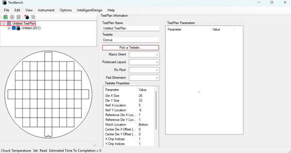
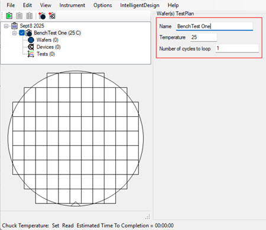
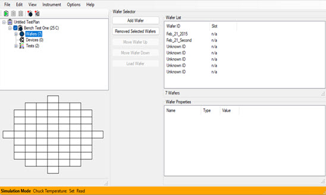
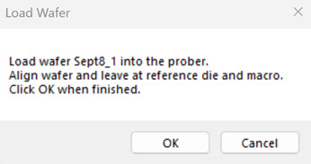
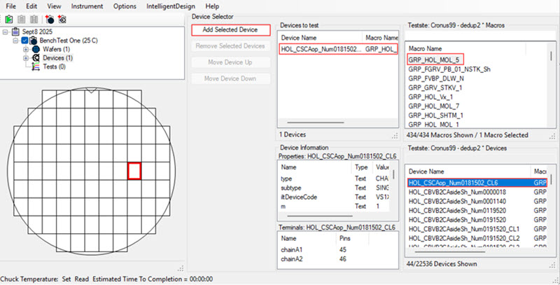
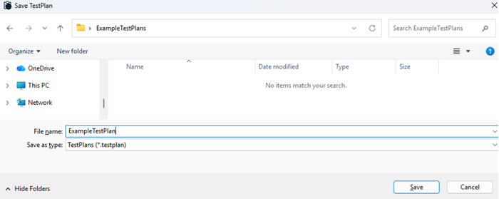
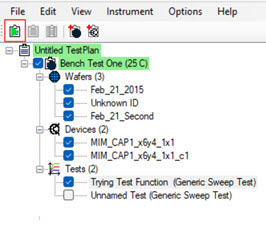
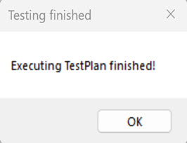

# TestBench Plan Configuration

Configuration of a TestBench Test Plan requires users to name their Test Plans and then define the wafers, devices, and tests to include within each Test Plan. Each BenchTest TestPlan can be configured to run multiple tests on multiple devices simultaneously. Selecting a testsite for a TestBench Plan requires that users select a **Local** testsite or an **Intelligent Design** testsite. The **Local** designation is for testsites that are saved locally and the **Intelligent Design** designation is for testsites from Intelligent Design. Test results are collected and are stored locally and are visible in the Data Viewer. You can view Test Plans by clicking **View** \> **Simple Data Viewer** \> **** on the file menu within the BenchTest application to view the Simple Data Viewer.

Defining a Test Plan requires users to know the goals of the Test Plan and then to configure a Test Plan that supports the goal. Using BenchTest Test Plans, a user can configure a TestPlan and TestSite and run WaferTestPlans and DeviceTestPlans. In the TestBenchTest Plan window, the configuration path is a node structure. Each node represents a configuration step to configure a TestPlan. Each node in the structure is expandable by clicking the node's **+/-** control.

Each WaferTestPlan can run multiple DeviceTestPlans on a set of wafer. Wafers are tested sequentially and not simultaneously.

Use the following procedure to configure your TestPlan.

1.  Click **File \> Untitled Test Plan** in the TestBench application to open the Test Plan Information Explorer window. Complete the following fields.

    -   Name the Test Plan
    -   Click **Pick a Testsite** to open the Testsite Manager.

        

    -   Click a **Local** or **Intelligent Design** testsite. **Local** testsites are saved locally. **Intelligent Design** testsites are for projects from Intelligent Design.

        

        **Note:** If an **Intelligent Design** project is selected, the system downloads all the macros and devices. Macros automatically populate with all possible values and users can filter them by choosing orientation, layout, pitch, and optionally pad dimensions. Layout choices determine which macros and devices can be used in a TestPlan. For example, when a 2X50 layout is selected, only the 108X80 pitch is available. With the 1X25 layout selection, there are multiple possible pitches available. If any of the selectors are changed, some devices might be removed due to incompatibility.

        When you select a **Local TestSite** information about the macros and devices is stored on a file on your computer as you build your TestPlan.

    -   Click **Ok**. The selected Testsite and the Testsite associated properties display in the **TestSite Manager** Explorer Window. The system downloads all the Macros and Devices.

        

    **Note:** If an **Intelligent Design** project is selected, the system downloads all the corresponding macros and devices. Macros automatically populate with all possible values and users can filter them by choosing orientation, layout, pitch, and optionally pad dimensions. Layout choices determine which macros and devices can be used in the TestPlan. For example, when a 2X50 layout is selected, only the 108X80 pitch is available. With the 1X25 layout selection, there are multiple possible pitches available. If any of the selectors are changed, some devices might be removed due to incompatibility.

    Each **Intelligent Design** project has a set of corresponding macros \(and orientation, layout, pitch, and pad dimensions\). If a macro in a project changes, all the corresponding devices and settings are changed as well.

    When you select a **Local TestSite** the information about the macros and devices is stored on a file on your computer as you build your TestPlan.

2.  Click **OK**. The testsite selection displays and populates the Macros, Probecard Layout, Pitch, and Pad Dimensions associated with the TestSite.

    

3.  Click the TestBench**Test Plan** node to open the Test Plan Information Explorer window. Complete the fields for your test plan. The Temperature Field must match the temperature for the prober you intend to use.

    -   Name: Name the bench test.
    -   Temperature: Input a temperature
    -   Loops: Input a numerical value for the number of loops for the test
    

4.  Click the **Wafers** node to open the **Wafer Selector** Explorer Window. In this window you can add, remove, and load wafers for testing and view wafer properties. Click **Add Wafer** to add Wafers to the Test Plan. Selected wafer display in the Wafer List and you can click an individual wafer to view its wafer properties. You can double-click the wafer in the Wafer List to rename the wafer.

    

    Wafers can be tested only one at a time. Multiple wafers are tested sequentially.

    **Note:** If the instance of the TestBench application has an autoloader, the selected wafers load automatically into the prober. Alternatively, use the **Load Wafer** control to add wafers to the Test Plan. An instructional modal opens that instructs you to align the wafer and leave it at reference die and macro.

    

    Click **Ok**.

    **Note:** Specify the dies to test in the selected wafers. Right click the Wafer Map, select a die location, and select **Move to Die**.

    

    The system moves the wafer into position.

5.  Click the **Devices** node to open the **Device Selector** Explorer Window. In the **Device Selector** Window, you can select Macros and their corresponding Devices to use in the Test Plan. Select a device and click **Add Selected Device**. The Device is added to the wafer.

    

    **Note:** You can select more than one device to test on a wafer, but those devices **must** have the same device terminals \(pins\). In TestBench, you can view the device pins in the Device Terminal Window.

    

6.  Click the **Test** node to open the **Test Selector** Explorer Window. In the **Available Types Section** Window, you can select Tests to add to the Test Plan.

    

    Click a test in the **Available Types Section** and then click the **Add Selected Tests** control. Hold **Cntl** and select tests to select multiple tests. The selected tests are displayed in the Tests section.

    **Note:**

    Two newly introduced file formats are now used to save testplans and devices. The new formats are \*.Testplan and \*.Device respectively. Formerly, testplans were saved in the \*.tp format but were not human readable. The new \*.Testplan file format is human readable. To read the files in the new format, you change the extension from \*.Testplan to \*.zip and then look inside the compressed file. This file format change from \*.tp files and \*.dev files to \*. Testplan and \*.Device is an incompatible upgrade \(old files will not open\)

7.  Click **Save** to save your testplan in the new format, **.testplan**. The testplan is saved.

    

8.  Click the **run Test Plan** icon to run the test.

    

    The test runs and when the test completes, a modal opens.

    

    The completed test plan data is stored locally but is visible in the **Data Viewer**. View the completed Test Plans by clicking **View** \> **Simple Data Viewer** \> **** on the file menu to view the Simple Data Viewer.

    

**Parent topic:**[TestBench Overview](../../id_docs/testbench/testbench_overview.md)

