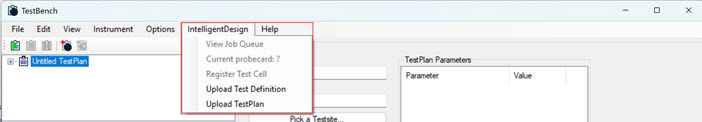
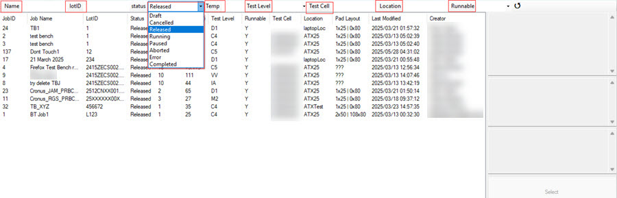
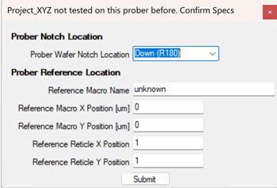
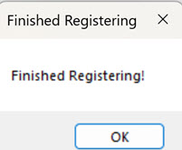

# Intelligent Design Jobs in TestBench

Intelligent Design \(ID\), Intelligent Test \(IT\), and TestBench work together in processing IT test plans. IT testers can send test plans to TestBench for execution. As the test plans run in TestBench, IT users in ID can view the status of all tests plans as they run. In the TestBench app, the Job queue displays details of each job that it received from IT. Test plans ID sends to TestBench are view only and cannot be modified.

**Note:** If any changes are made in TestBench, either to probecards or instrument calibration, those changes are only made locally. To notify and register these changes in ID, you must **Register the Test Cell** after each local change. When running TestBench in simulation mode, some ID-related features are disabled, notably View Job Queue, Current Probecard, and Register Test Cell.

## Intelligent Design Integration

A successful login to TestBench establishes the communication between ID and TestBench by introducing the **IntelligentDesign Menu** in Test Bench.

See [Logging in to TestBench](logging_into_testbench.md). To learn more about the Intelligent Design TestBench integration see [Test Bench](../test_bench.md).The following screen shot shows the **Intelligent Design** menu as it displays in Simulation mode.

From the **Intelligent Design Menu**, TestBench users can:

1.  **View the Job Queue** The Job Queue lists all test plan jobs received from ID and are ready to run. By default, only released jobs display in the job queue. Columns within the job Queue are sortable, and selecting a single report reveals even more details about the job, such as description, wafer ID, probecards, and instruments used in the test plan. Click the **Refresh** icon to refresh the job queue display to see new jobs that might have been received from ID.

    

    You can click the space after each of the job menu items and search within that menu item. Menu items are: Name, Lot ID, status, Temp, Test Level, Test Cell, Location, and Runnable. The following screen capture shows the status search field open.

    

2.  **Running IT Jobs** To run a job, select the job and click **Select**. A system prompt requests that you confirm the Job number. Click **OK**. If it is the first time that this test is going to run, a Confirm Prober dialog opens.

    

    Click **Submit**. The Test Plan is sent to TestBench and within the TestBench application, you click the **Execute Job** control. The job executes and begins transmitting the test result to IT.

3.  **Aborting IT Jobs** if for some reason a job that is running in TestBench stalls or the test cell crashes, you might need to **Abort** the job in TestBench. When either of these things happen, ID is unaware of the stalled job or test cell crash. Aborting the test in TestBench stops the test and communicates the abort status to IT. To **Abort** the job, right click the job and click **Abort**. A system dialog opens and requests the reason for the action. Complete the field and click **OK**. Providing a reason for aborting the test help users to identify issues that might be encountered.

## New Configuration Features

The following configuration features support the Intelligent Design TestBench integration.

**Probecard Change**

Probecards are used for electrical testing on wafers. Use the following steps to change the probecard in TestBench.

1.  **Intelligent Design** \> **Current probecard** to open the dialog box.
2.  Complete the fields in the dialog box.

    

3.  Click **Submit**.
4.  The new probecard is registered locally.
5.  **Intelligent Design** \> **Register Test Cell** to reregister the test cell in ID.

**Instrument Calibration Records**

Use these steps to update the calibration details of TestBench instruments.

1.  **Intelligent Design** \> **System Test**.
2.  Scroll to select an instrument and right click and select **Last Calibrated ?**.
3.  A modal opens and prompts you to enter a new calibration date. Enter the date as prompted and click **OK**. The instrument is now recalibrated.

    **Note:** You must **Register the Test Cell** after **ALL** local TestBench changes, including Probecard changes or instrument changes or calibrations.

**Register the Test Cell**

Changes that are made to Probecards or Instruments \(changing instruments or calibrations\) within TestBench are only recorded locally. To register Probecard or Instrument changes in Intelligent Design, each change must be registered with the test cell. See the following information on registering the test cell. Register the Test Cell every time a probecard is updated or an instrument is changed or recalibrated.

1.  **Intelligent Design** \> **Register Test Cell**. The Test Cell initiates registration and displays a message when complete.

    

2.  Click **OK**.

**Parent topic:**[TestBench Overview](../../id_docs/testbench/testbench_overview.md)

