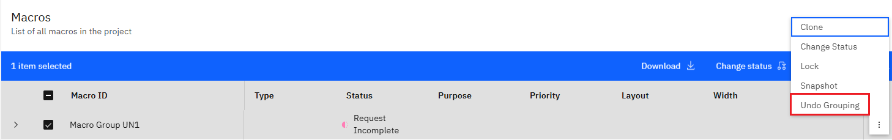
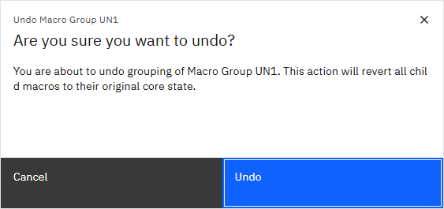
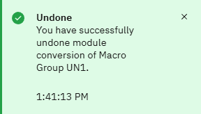

# Ungrouping macros

If needed, Macro groups can be broken up while keeping the macros that made up the group available in the project.

Macros can be ungrouped at any time, without deleting the macros that comprise the group, so they may be reused as part of other groups.

1.  On the Project page click the **Hamburger Icon** for the Macro group and select **Undo Grouping** to bring up a confirmation modal

2.  On the confirmation modal, click **Undo** to confirm the ungrouping. Note that an ungrouping cannot be reversed. 

3.  After clicking **Undo** the macro group will be deleted and its component macros will be available for other groups. 

**Parent topic:**[Grouping Macros](../id_docs/grouping_macros.md)

