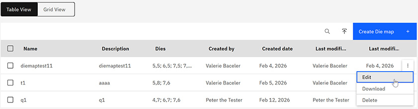
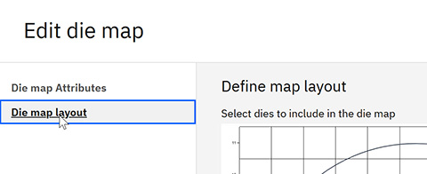

# Updating legacy Wafer Definitions after upgrade to R6.1

New functionality for Wafer Definitions and Die Map charts has been added in Intelligent Design R6.1. In order to implement that functionality with wafer definitions created in R6.0, you must update the Wafer Definitions using the following procedure.

Wafer Definitions created before R6.1 do not contain visual Die Map charts. Perform the following steps to add visual Die Map charts to existing Wafer Definitions.

To navigate to the Wafer Management page:

-   From the Intelligent Design app, click the **Switcher** icon and select **Intelligent Test**. On the left side of the Intelligent Test page, click **Wafer Management**. The Wafer Management page opens.

1.  On the Wafer Management page, click on the Wafer Definition you want to update to open the Details page.

2.  In the Die Maps **Table View**, click the **More** menu next to the Die Map you want to update, and select **Edit**.

    

3.  Click **Die map layout** in the navigation pane.

    

    **Optional:** You can add or change the dies to include in the die map.

4.  Click **Save**.

**Parent topic:**[Wafer Management](../id_docs/wafer_management.md)

