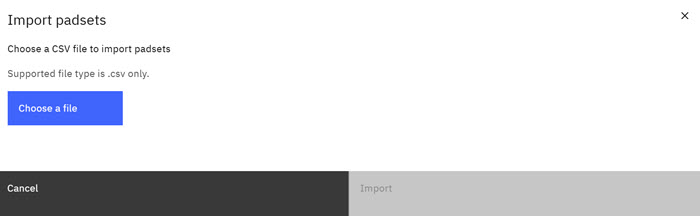

# Import Padsets

A Padset is a unique set of Pads. A Padset is used by assigning it to a project, and each Padset can be used only once. Use this import procedure to bulk upload multiple padsets.

**Note:** Only Project Administrators can create, assign, edit, import, export, or delete Padsets.

1.  Click your profile icon, then select **Administration configuration**.

2.  **Importing** Padsets
3.  On the Administration configuration page, click **Padset**. The **Padset** page opens. To Import a **Padset**.

    -   Click a checkbox to select a **Padset** and then click **Import** in the table menu bar. The **Import** modal opens.

        

    -   Click **Choose a File** and browse to the padset file you want to import.
    -   Click **Open**.
    -   The **Padset** is imported and displays in the list of **Padsets**.
    **Note:** Exported padsets can be edit and re-imported. See [Export Padsets](exporting_downloading_padsets.md).

**Parent topic:**[Padsets](../id_docs/padsets.md)

