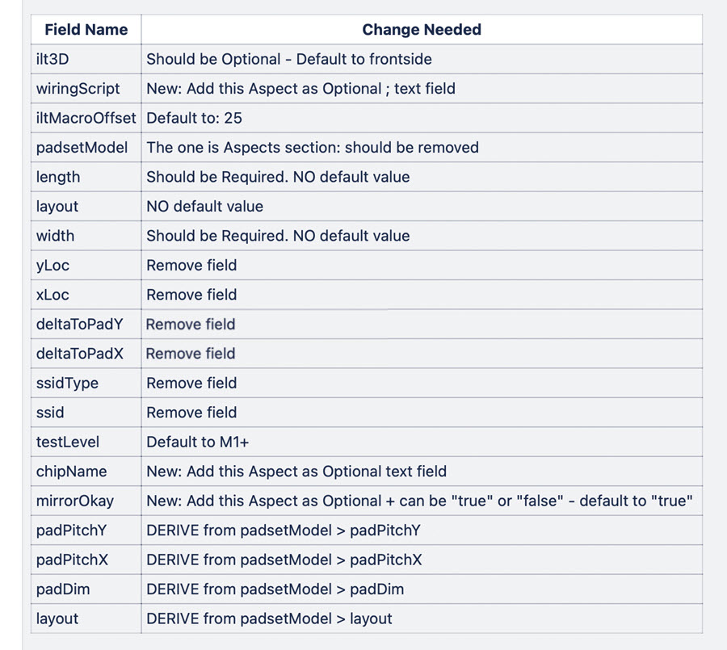
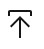
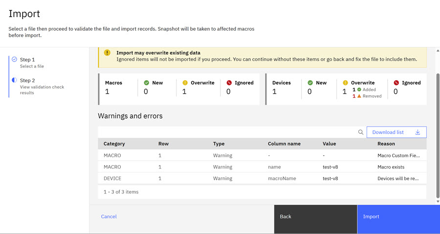

# Importing Macros and Devices

You can quickly create or update Macros and Devices on Testsite macros individually or in bulk in the Macro View by uploading a **csv** file that contains Macro and Device information.

Macro .csv import supports inserting new macros and updating existing macros by using matched Macro names and supports inserting and update in a single file. Device .csv import supports inserting new devices and updating existing devices by using matched Macro names and supports insert and update in a single file. Users must follow the .csv import rules and adhere to restrictions when you import macros and devices.

The macro import function now accepts import files containing macros with **ILT3D** designated as **Both**.

**Important:** Any grindside data present in the import file is ignored. The system derives grindside data internally from the frontside data. Grindside data in the import file does not override system-derived values. The import succeeds only when grindside derivation is successful.

CSV File Structure:

-   Each row represents a unique Macro or Device.
-   The file can contain only Macro attributes and aspects or Macro + Device attributes and aspects and pad assignments.
-   Modules and groups cannot be imported by using CSV.
-   If devices are included, the system automatically assigns them to the correct Macro based on the Macro Name.
-   You can add new aspects impromptu by including them in the file.
-   Optional fields must be present but can be null.
-   Custom Fields are only added when values are provided. Custom fields are ignored if empty. If Macros are being updated, custom fields are reset based on .csv content

The following tables outline the **Field Requirements**, **Validation Rules**, and **Error Handling**.

|MacroName|≤ 500 characters|
|Description|≤ 100 characters|
|Priority|Must be one of the following: -   high
-   medium
-   low
-   critical
-   experimental

|
|Macro Status|Must match valid system status values|

|Mandatory Fields|If any required fields are missing, the system displays an error message and permits you to download a gap file that lists items that failed validation for correction.|
|Invalid Values|The system specifies which field is invalid and the row number where the error occurred.|
|Duplicate Entries in File|Prompted as an error before processing.|
|Existing Macros/Devices|If the name exists, the record is updated. If not, a new record is inserted.|

|Missing fields|Line item displays an error and upload is rejected.|
|Invalid values|Rows with out-of-range or malformed data are highlighted.|
|Duplicate entries|If a macro or device exists, the user is prompted to update or skip.|

Best practices for preparing your .csv file:

-   Acquire the sample template first from your project administrator, or [download the Macros/Devices you want to update](download_macros.md).
-   Use consistent naming for Macros and Devices to avoid unintended updates.
-   Validate field values by ensuring that they match allowed values, and check character limits for MacroName and Description.
-   Avoid duplicates within the file.
-   Include all mandatory fields before upload.
-   Add aspects carefully: New aspects can be added impromptu, but must follow naming conventions.
-   Save the file in UTF-8 encoding to prevent special character issues.
-   Test with a small batch first before you upload large files.
-   If using PCELL data, it is recommended to use a file for each PCELL.

How **Import** works.

-   **No Existing Macros**

    Macros are inserted when required fields are present and have valid values. Optional standard fields not included within the uploaded file default to system values. See [Figure 1](#fig_r1n_qbg_rjc). Custom fields present in the csv are ignored if the value is not null. Devices are inserted according to csv mapping to the Macro by using the Macro Name provided in the csv.

-   **Macros Exist with No Devices, Verified by using Macro Name, Macros are updated**

    Required fields are present and have valid values. Optional standard fields not included within the uploaded file, default to system values. See [Figure 1](#fig_r1n_qbg_rjc). Custom fields present in the csv are ignored if the value is not null. Devices are inserted according to csv mapping to the Macro by using the Macro Name provided in the csv.

-   **Macros Exist with Devices \(Verified by using Macro Name\) Macros are updated.**

    Required fields are present and have valid values. Optional standard fields not included within the uploaded file, default to system values. See [Figure 1](#fig_r1n_qbg_rjc). Custom fields are added if the value is not null. Existing devices are replaced by using the content of the csv.

1.  On the **Macro View** tab, click the Import icon. .

    The Import screen opens.

    

2.  Click **Select File** and browse to the .csv file. Click **Open**.

    

    The selected import file displays in the modal.

3.  Click **Validate** to validate the .csv and the macros and devices within the .csv file.

    

    **Note:** The Validation preview presents the **Warnings and Errors** status of the import and the potential impact on existing macros and devices. Hover over the reason column to see warning details. Make adjustments as necessary.

    

4.  Click **Import** to complete the import. The imported and updated Marco and Devices display.

After a successful upload, the modified Macro appears at the top of the list. A system notification confirms a successful import. Click **View Update** to browse to the updated Macro View. See [Taking a snapshot of a Macro](take_snapshot.md) snapshots to learn more about snapshots.

-   **[Uploading Devices on Multiple Macros](../id_docs/uploading_device_on_multiple_macro.md)**  
You can quickly create or update Macros and Devices on Testsite macros individually or in bulk in the Macro View by uploading a **Devices-only-csv** file. The **Devices-only-csv** file contains only Device information. When uploading using the **Devices-only-csv** file, devices are added to macros that do not have devices and can also be added to Macros named in the **Devices-only-csv**. Users must follow the .csv import rules and adhere to restrictions when importing macros and devices.

**Parent topic:**[Macros](../id_docs/macros.md)

