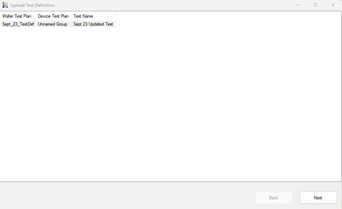
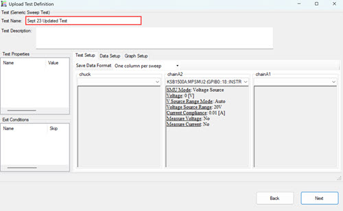
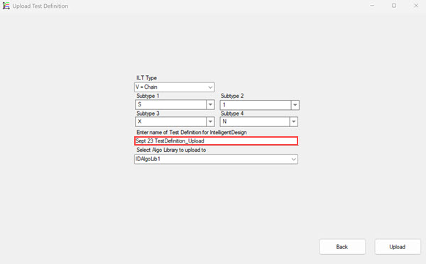

# Uploading Test Definitions to Intelligent Design

Supported Tests within TestBench can be uploaded as **Test Definitions** to the Intelligent Design system. Supported tests are **Generic Sweep Test**, **Generic Constant Stress Test**, **Generic Pulse Test**, **Generic Keithley TSP**, **Generic Keithley TSP Parallel**, **Generic Ramp Stress**, **Probe Check**, and **WGFMU BTI /HCI DC/AC**. **Generic Constant Stress Testnsubtests** are **NOT**supported and uploaded test definitions do not include the subtests even if they are present in the TestBench test.

Use the following procedure to upload a TestBench test as a **Test Definition** to Intelligent Design.

**Note:** Only users who are on teams assigned to the project that is referenced in a TestBench job can view, edit, delete, or download that TestBench job.

.

1.  In TestBench, create a test.

    **Note:** The created test definition that is used in this instance is only usable with devices of the same type and subtype as defined when setting up the test in TestBench.

2.  Ensure that you are logged in to Intelligent Design.

3.  Click **Intelligent Design** \> **Upload Test Definition**to start the upload process. A modal opens requesting you to **Select Tests**.

4.  Click the tests that are shown in the modal that you want to upload. The modal is designed to include all tests currently included in the open test plan.

    

5.  Click **Next**. A modal opens with options to modify the test and enter a description of the test. You can make minor changes. Enter the **Test Name**. These changes apply only to the test definition that you are uploading.

    

6.  Click **Next**. The **Select a Generic Terminal** modal opens. This modal displays the chosen generic terminal. Click **Next**.

    

7.  The **ILT Type** modal opens.

    -   Complete the ILT Type and SubType fields if known, otherwise leave blank
    -   Enter a **Unique Name** for the Test Definition that is not presently used in Intelligent Design
    -   Select the **Algorithm Library**
    

    Click **Upload**.

8.  When the upload completes, a success prompt displays. The Uploaded test definition now displays in the **Test Definition** table in Intelligent Test. The uploaded test definition can now be used to create test plans and jobs for TestBench.

    

**Parent topic:**[Test Bench](../id_docs/test_bench.md)

