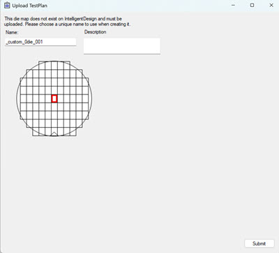
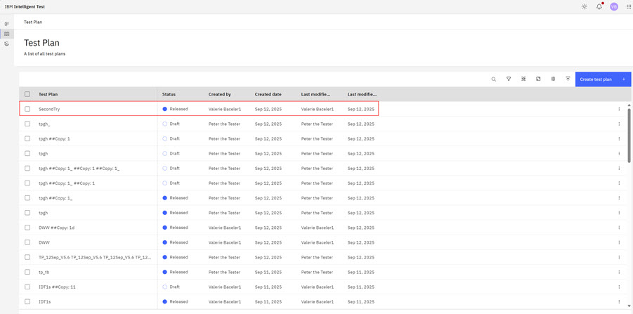
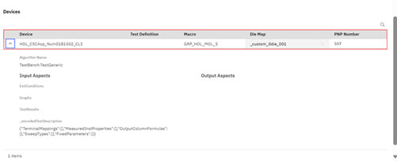

# Uploading Test Plans to Intelligent Design

Use the following procedure to upload a TestBench test as a **Test Plan** to Intelligent Design.

**Note:** Only users who are on teams assigned to the project that is referenced in a TestBench job can view, edit, delete, or download that TestBench job.

.

1.  In TestBench, create a test plan. See [Creating a Test Plan](it_create_test_plan.md)

2.  Ensure that you are logged in to Intelligent Design.

3.  Click **Intelligent Design** \> **Upload Test Plan** to start the upload process.

    The TestBench Upload TestPlan Modal opens.

    

4.  Complete the fields in the TestBench Upload TestPlan Modal.

    -   Testplan Name
    -   Select the Algorithm Library
    -   Select the Probecard
    -   Input the PNP Number
    Click **Begin Testplan Upload**.

5.  If the Die you are uploading does not exist in ID, the system displays another Upload TestPlan modal. Assign the Die a Unique name and click **Submit**. The Testplan is uploaded to ID.

    

6.  When the upload completes, a success prompt displays. The uploaded test definition can now be used to create test plans and jobs for TestBench.

7.  Navigate to the Test Plan page. From the Intelligent Design app, click the **Switcher** icon and select **Intelligent Test**. Select the **Test Plan** icon in the left navigation pane. The Test Plan page opens.

    

8.  Click the Test Plan in the Test Plan table and scroll to the **Devices** section. Click the down arrow to open detailed Device Information.

    

**Parent topic:**[Test Bench](../id_docs/test_bench.md)

